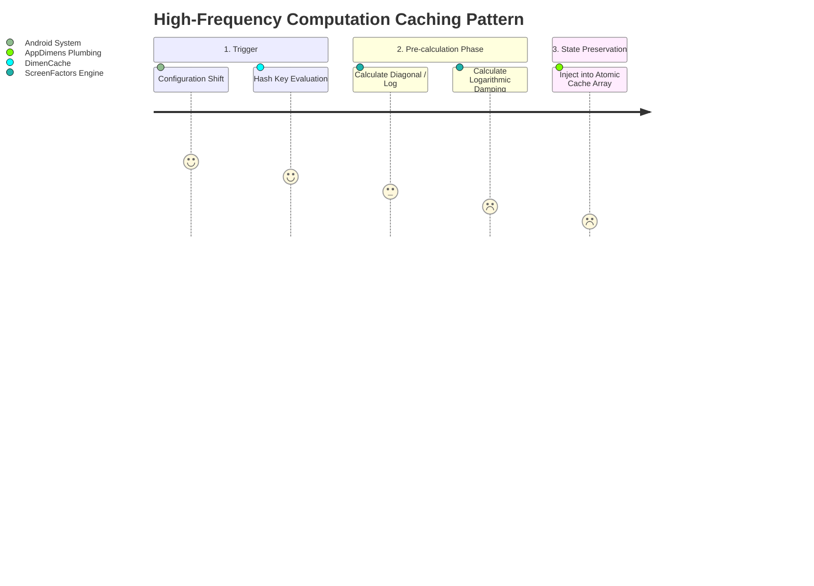

# Mathematics and Calculus — AppDimens Dynamic

> [!NOTE]
> Formal Technical Reference validating the geometry mapping against `android.content.res.Configuration`.
> **Associated Documents:** [PRD (Requirements)](PRD.md) | [PDR (Design)](PDR.md) | [Resize Spec](resize.md)

This document establishes the geometric algorithms parsing system UI inputs to logical device dimensions, mapping exact equations translated natively into `AppDimens Dynamic` (`compose.<strategy>` and `code.<strategy>`).

---

## 1. Axioms & Mathematical Nomenclature

Consistent parameter inputs establish standard behavior across all dimension computations:

| Algebraic Symbol | Definition & Behavior Matrix |
|:---:|:---|
| $$b$$ | Base scalar value provided by the application natively (usually constrained to standard dp or sp). |
| $$d$$ | Effective target axis constraint (width vs height) validated post-rotation logic via `DimenCalculationPlumbing`. |
| $$w, h$$ | Hardware screen `screenWidthDp` and `screenHeightDp`. |
| $$s_{min}, s_{max}$$ | Mathematical limits: Shorter/Longer boundary conditions in `dp` extracted universally. |
| $$sw$$ | The `smallestScreenWidthDp` threshold in device orientation logic. |
| $$\rho$$ | System Aspect Ratio: $$\rho = s_{max} / s_{min}$$ (Guarded against computational Zero). |
| $$r_{AR}$$ | Standardized Aspect Ratio normalized against the native base. $$r_{AR} = \rho / 1.78$$ |
| $$L_{AR}$$ | Logarithmic normalizer representing device stretch: $$L_{AR} = \ln(r_{AR})$$ |
| $$k$$ | Dynamic system sensitivity mapping or User-injected correction modifier ($$k$$). |

---

## 2. Hardcoded Core Mathematical Constants

```kotlin
// Referencing com/appdimens/dynamic/core/DesignScaleConstants.kt
const val BASE_WIDTH_DP = 300f 
const val BASE_HEIGHT_DP = 533f 
const val REFERENCE_ASPECT_RATIO = 1.78f 
```

**Geometric Corollaries:**
- $$Base\ Diagonal = \sqrt{300^2 + 533^2} \approx 611.63\text{dp}$$
- $$Base\ Perimeter = 300 + 533 = 833\text{dp}$$
- $$Scale\ Factor (\iota) = 1 / 300 \approx 0.0033333334$$

---

## 3. Global Precomputation Matrix (`ScreenFactors`)

Device configurations trigger an asynchronous computation vector (`updateFactors`), isolating heavy geometric calculations outside the standard Render Pass.



### Analytical Variables generated mapping to UI Thread:
1. **Linear Limit:** `f.scale` $$= sw \cdot \iota$$
2. **Normalized Multiplier:** `f.arMultiplier` $$=  1 + (sw - 300) \cdot (\iota_{adj} + k_{def} \cdot L_{AR})$$
3. **Power Translation:** `f.powerScale` $$= (sw / 300)^{0.75}$$
4. **Logarithmic Yield:** `f.logScale` evaluated precisely over `sw`:  
   $$Scale = 1 + 0.4 \cdot \ln(sw \cdot \iota)$$
5. **Density Override:** `f.density` $$= densityDpi / 160f$$

---

## 4. Fundamental Dimension Engine Routines

Algorithms dictate absolute dimension translations based on injected strategy vectors. All variables operate linearly unless Multi-Window/Desktop protocols enforce default return blocks (`bypass` triggers).

### 4.1 The Scaled Engine Default (Linear Translation)
Function path: `DimenCache.calculateRawScaling(baseValue, applyAspectRatio)`

*   **Aspect Ratio (OFF):** 
    $$Output = b \cdot (sw \cdot \iota)$$
*   **Aspect Ratio (ON + NO Custom Sensitivity):**
    $$Output = b \cdot \texttt{f.arMultiplier}$$
*   **Aspect Ratio (ON + Injection \(k\)):**
    $$Output = b \cdot \left[1 + (sw - 300) \cdot (\iota_{adj} + k \cdot L_{AR})\right]$$

### 4.2 Comprehensive Strategy Formulas

> [!TIP]
> The engine defaults to extremely low computational complexity via direct linear equations or natively precomputed constants out of the `ScreenFactors` bounds mapping.

| Strategy Class | Mathematical Formalization | Base Operational Logic |
|:---|:---|:---|
| **Percent** | $$Output = b \cdot d \cdot \iota$$ | Standard relative mapping mapped to constraints without bounds injection. |
| **Power** | $$Output = b \cdot (d / 300)^{0.75}$$ | Sublinear progression; dimensions expand at reduced magnitudes mitigating ultra-large bounds overlap. |
| **Fluid** | $$v = \text{LeRP}\left([320,768], b\cdot 0.8, b\cdot 1.2\right)$$ | Smooth threshold scaling restricted to web-standard device margins. |
| **Logarithmic** | $$Output = b \cdot \left(1 \pm 0.4 \cdot \ln(\dots)\right)$$ | High damping factor pushing text limits safely regardless of tablet geometry bounds. |
| **Diagonal** | $$Output = b \cdot \left(\frac{\sqrt{s_{min}^2 + s_{max}^2}}{611.63}\right)$$ | Mapping visual boundaries accurately to hypotenuse scale. |
| **Fill & Fit** | $$Fill = b \cdot \max(r_w, r_h)$$ <br> $$Fit = b \cdot \min(r_w, r_h)$$ | Max bounds enforcement referencing explicit screen fractions to image frames. |

---

## 5. Constraint Injection Geometry (Resize Subsystem)

The resize model calculates optimal dimension capacity isolated inherently from scaling curves, driven by explicit spatial boundaries.

**Subsystem Mathematics (`ResizeMath.kt`)**
1. **Linear Candidate Creation:** Generating isolated step parameters defining bounds:
    $$C = \{ Min, Min+Step, Min+2\cdot Step \dots Max \}$$
2. **Binary Search Analysis:** Operates $\mathcal{O}(\log n)$ tests querying an injected boolean Lambda against geometric constraints returning the Absolute Optimal Max size before overflow.
3. **Data Integrity:** Employs physical conversion filters evaluating natively: `require(density > 0)`, shifting values dynamically prior to geometric validation.

---

## 6. Precision Diagnostics & Output Evaluation

AppDimens is designed entirely on **IEEE 754 32-bit floats (`Float`)**, acknowledging minuscule mathematical deviations natively in standard testing. Validation of curves explicitly applies acceptable `< 0.05` deltas ensuring visual integrity without overtaxing memory buses with `Double` precision arrays.

Explicit module verification operates via `./gradlew :library:test` executing deterministic parameter inputs into `StrategyModuleFormulasTest.kt`.
