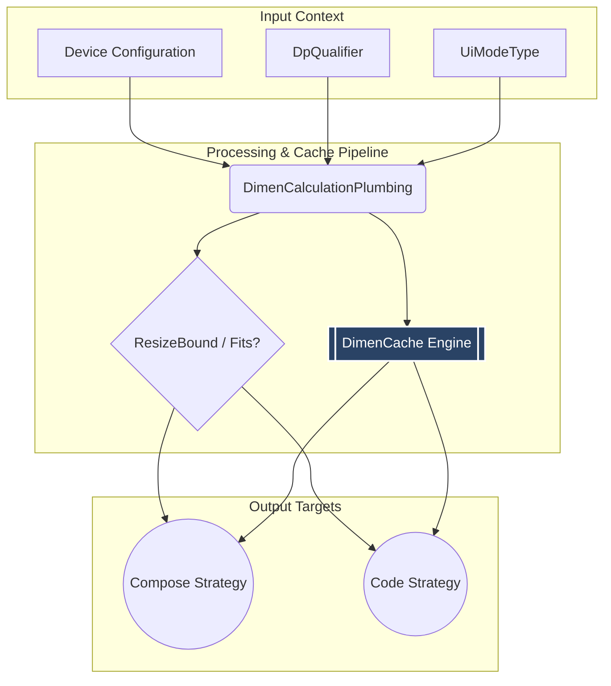
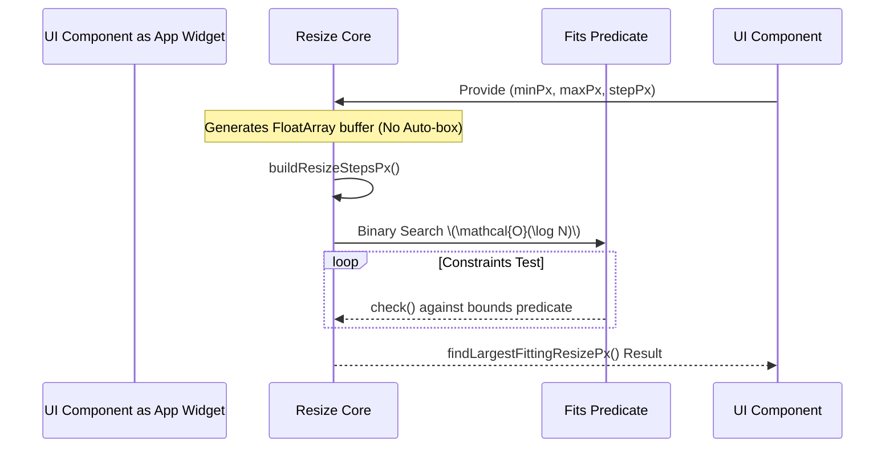

# Project Design Document (PDR) — AppDimens Dynamic

> [!NOTE]
> **Product Alignment:** `io.github.bodenberg:appdimens-dynamic:3.1.5`
> **Associated Documents:** [PRD (Requirements)](PRD.md) | [Mathematics](MATHEMATICS-AND-CALCULUS.md) | [Performance Specs](../library/PERFORMANCE.md)

This internal architecture document mandates the precise structural logic, technical dependencies, caching behaviors, and quality integration required by the AppDimens Dynamic `library` package.

---

## 1. Traceability & Package Matrix

**Core Index:** 180 `.kt` logical components under `library/src/main/java/com/appdimens/dynamic/`.

| Subsystem Domain | Crucial Topologies | Domain Core Strategy | Active Verification Gates |
|:---|:---|:---|:---|
| `core` / `common` | `DimenCache`, `ResizeMath`, `DpQualifier` | Unified Mathematics & Core cache. | `DimenCacheTest`, `DimenPerformanceTest` |
| `compose.scaled` | `DimenScaled`, `*Extensions` | Base Reference Anchors | `StrategyModuleFormulasTest` |
| `compose.percent` | `DimenPercentSpace`, `DimenPercentPlainPx`| Context Fractions | `StrategyModuleFormulasTest` |
| `compose.geometric` | `diagonal`, `perimeter`, `fit`, `fill`| Shape/Geometric Scaling | `StrategyModuleFormulasTest` |
| `code.plain` | `DimenPlainBranch.kt` | Raw `Context` Contextualing | `DimenPlainBranchTest` |
| `compose.resize` | `DimenResize` | Asymptotic Search Subsystem | `DimenResizeCodeUnitTest` |

---

## 2. Technical System Architecture

### 2.1 Unified Interaction Flow

> [!IMPORTANT]
> **Architectural Invariant:** Code/Modules defined as `compose.<strategy>` **must never** intersect or implicitly construct elements of a differing strategy module. Code routing is strict: `strategy` \(\rightarrow\) `core` \(\rightarrow\) `common`. 

### 2.2 Cache Anatomy & Thread Engineering

**The `DimenCache` Subsystem** calculates, stores, and evaluates layout keys natively using bitwise parameters on primitive vectors to minimize Garbage Collection penalties.

* **64-bit Payload Signature:** Keys generated using a complex boolean flag logic including parameters: `applyAspectRatio`, `baseValue(float_bits)`, `CalcType_Enum`, `DpQualifier`, and `multiWindowConstraints`. 
* **State Bypass Architecture:** Core types (`PERCENT`, `SCALED`, `DENSITY`) natively bypass associative shard writing when aspect ratios are inactive, generating results strictly based on raw mathematics for near-zero timing (refer to `PERFORMANCE.md`).
* **Volatility Pre-rendering:** `ScreenFactors` are preemptively evaluated and hot-swapped during configuration changes, pushing heavy logarithmic calculations completely outside of the Compose recomposition phase.

---

## 3. Asymptotic Resize Constraint Mechanism

The resize layer runs distinct logic isolated from general curves, dedicated exclusively to rendering bounds to physical limits.

## 4. Development Quality & Reliability Matrix

### 4.1 Release Constraints
1. **Module Artifacting:** Built and aligned under the standard Kotlin multiplatform `mavenPublishing` protocol targeting Maven Central.
2. **Obfuscation Integrity:** Comprehensive ProGuard rules (`consumer-rules.pro`) ensure public API parity and runtime stability natively. 

### 4.2 Known Technical Risk Mapping

| Monitored Technical Risk | Built-In Mitigation & Failsafes |
|:---|:---|
| **ARM64 Cache Desynchronization** | Cache primitives strictly tagged with `@Volatile`. Active concurrency verified in `DimenCacheRaceTest`. |
| **R8 Heavy Obfuscation Stripping** | Dedicated consumer rules preserving reflection vectors unstripped (Refer to [R8-PROGUARD.md](../R8-PROGUARD.md)) |
| **Dokka HTML API Drift** | Scripts provided locally `scripts/sync_kdoc_from_dokka_html.py` correct `ERROR CLASS` issues caused by Jetpack Compose compiler nuances. |

---

## 5. System Check protocols for Engineering Mates

When modifying structural parameters or curves, engineers must ensure the following baseline protocols are met prior to merging PRs:
- [ ] Ensure **Code/Compose Parity**. Modify the `code` extension symmetrically when introducing a new Compose builder.
- [ ] Execute `./gradlew :library:test` and visually cross-check output against `DimenPerformanceTest`.
- [ ] If mutating `ScreenFactors`, actively adjust bits in `DimenCache` alongside mathematical models evaluated in `MATHEMATICS-AND-CALCULUS.md`.
