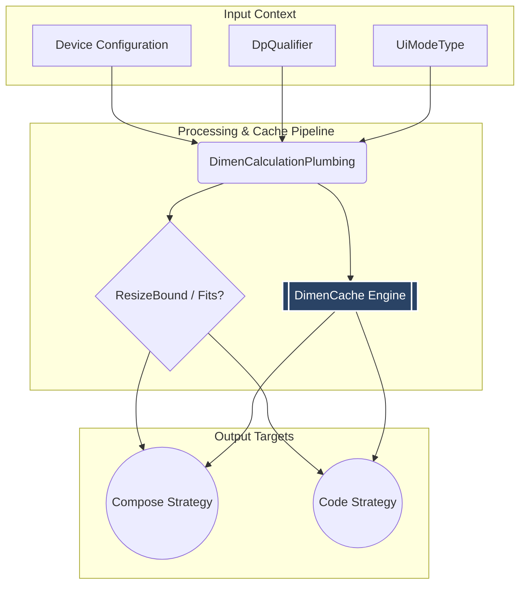
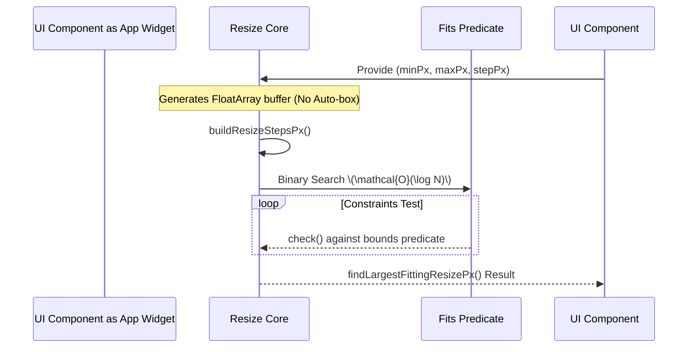

# Project Design Document (PDR) — AppDimens Dynamic

> [!NOTE]
> **Product Alignment:** Modular Maven artifacts at **`3.1.6`** — principal `io.github.bodenberg:appdimens-dynamic` (common + core + scaled + plain) plus opt-in `appdimens-dynamic-<strategy>` satellites. **No ALL/BOM aggregator.**
> **Associated Documents:** [PRD (Requirements)](PRD.md) | [Mathematics](MATHEMATICS-AND-CALCULUS.md) | [Performance Specs](../library/PERFORMANCE.md) | [README migration](../README.md)

This internal architecture document mandates the precise structural logic, technical dependencies, caching behaviors, and quality integration required by the AppDimens Dynamic library modules.

---

## 1. Traceability & Package Matrix

**Core Index:** ~180 `.kt` logical components across `:library` (principal) and `:library-<strategy>` satellites. Packages remain `com.appdimens.dynamic.*`.

| Subsystem Domain | Gradle / Maven | Crucial Topologies | Active Verification Gates |
|:---|:---|:---|:---|
| `core` / `common` | `:library` / `appdimens-dynamic` | `DimenCache`, `StrategyFactorRegistry`, `DpQualifier` | `DimenCacheTest`, `StrategyFactorRegistryTest`, `DimenPerformanceTest` |
| `compose`/`code` scaled + `plain` | `:library` / `appdimens-dynamic` | `DimenSdp*`, `DimenPlainBranch` | `DimenPlainBranchTest` |
| `compose.percent` / `code.percent` | `:library-percent` | `DimenPercentSpace`, `*PlainPx` | `PercentFormulasTest` |
| geometric (`diagonal`/`perimeter`/`fit`/`fill`) | respective `:library-*` | strategy `*Dp` / `*Extensions` | `DiagonalFormulasTest` (+ peer formula tests) |
| `compose.auto` / `code.auto` | `:library-auto` | `DimenAuto*` | `AutoFormulasTest` |
| `compose.resize` / `code.resize` | `:library-resize` | `DimenResize` | `DimenResizeCodeUnitTest` |

---

## 2. Technical System Architecture

### 2.1 Unified Interaction Flow

```mermaid
flowchart TD
  subgraph Input Context
    UI_Mode[UiModeType]
    Qualifiers[DpQualifier]
    Config[Device Configuration]
  end

  subgraph Processing & Cache Pipeline
    Plumbing(DimenCalculationPlumbing)
    CacheCore[[DimenCache Engine]]
    Constraints{ResizeBound / Fits?}
  end

  subgraph Output Targets
    TreeCompose((Compose Strategy))
    TreeCode((Code Strategy))
  end

  Config --> Plumbing
  Qualifiers --> Plumbing
  UI_Mode --> Plumbing

  Plumbing --> CacheCore
  Plumbing --> Constraints
  Constraints --> TreeCompose & TreeCode
  CacheCore --> TreeCompose & TreeCode

  style CacheCore fill:#2A4365,stroke:#fff,stroke-width:2px,color:#fff
```

> [!IMPORTANT]
> **Architectural Invariant:** Code/Modules defined as `compose.<strategy>` **must never** intersect or implicitly construct elements of a differing strategy module. Code routing is strict: `strategy` \(\rightarrow\) `core` \(\rightarrow\) `common`. Satellites depend **only** on the principal artifact — never on each other.

### 2.0 Maven / Gradle module graph (3.1.6)

| Gradle project | Maven coordinate | Contents |
|---|---|---|
| `:library` | `appdimens-dynamic` | `common`, `core` (+ `StrategyFactorRegistry`), `code.plain`, scaled |
| `:library-<strategy>` | `appdimens-dynamic-<strategy>` | `code.<strategy>` + `compose.<strategy>` |

Strategy-specific precomputed scales (diagonal/power/log/interpolated/perimeter) register via [`StrategyFactorRegistry`](../library/src/main/java/com/appdimens/dynamic/core/StrategyFactorRegistry.kt) so absent satellites do no work in `updateFactors()`.

`CalcType` ordinals remain fixed in core for cache-key stability even when a satellite is not on the classpath.

### 2.2 Cache Anatomy & Thread Engineering

**The `DimenCache` Subsystem** calculates, stores, and evaluates layout keys natively using bitwise parameters on primitive vectors to minimize Garbage Collection penalties.

* **64-bit Payload Signature:** Keys generated using a complex boolean flag logic including parameters: `applyAspectRatio`, `baseValue(float_bits)`, `CalcType_Enum`, `DpQualifier`, and `multiWindowConstraints`. 
* **State Bypass Architecture:** Core types (`PERCENT`, `SCALED`, `DENSITY`) natively bypass associative shard writing when aspect ratios are inactive, generating results strictly based on raw mathematics for near-zero timing (refer to `PERFORMANCE.md`).
* **Volatility Pre-rendering:** `ScreenFactors` are preemptively evaluated and hot-swapped during configuration changes, pushing heavy logarithmic calculations completely outside of the Compose recomposition phase.

---

## 3. Asymptotic Resize Constraint Mechanism

The resize layer runs distinct logic isolated from general curves, dedicated exclusively to rendering bounds to physical limits.

```mermaid
sequenceDiagram
    participant UI Component as App Widget
    participant ResizeMath as Resize Core
    participant TestLogic as Fits Predicate

    UI Component->>ResizeMath: Provide (minPx, maxPx, stepPx)
    Note over ResizeMath: Generates FloatArray buffer (No Auto-box)
    ResizeMath->>ResizeMath: buildResizeStepsPx()
    ResizeMath->>TestLogic: Binary Search \(\mathcal{O}(\log N)\)
    loop Constraints Test
        TestLogic-->>ResizeMath: check() against bounds predicate
    end
    ResizeMath-->>UI Component: findLargestFittingResizePx() Result
```

## 4. Development Quality & Reliability Matrix

### 4.1 Release Constraints
1. **Module Artifacting:** Each Gradle module publishes its own Maven Central coordinate at shared version `appdimens.version` (`3.1.6`). Principal = `appdimens-dynamic`; satellites = `appdimens-dynamic-<strategy>`. **No ALL/BOM/aggregator.** See [MODULES.md](MODULES.md).
2. **Obfuscation Integrity:** Per-AAR ProGuard consumer rules (`consumer-rules.pro`) ensure public API parity and runtime stability; satellites keep strategy packages, principal keeps core/scaled/plain. 

### 4.2 Known Technical Risk Mapping

| Monitored Technical Risk | Built-In Mitigation & Failsafes |
|:---|:---|
| **ARM64 Cache Desynchronization** | Cache primitives strictly tagged with `@Volatile`. Active concurrency verified in `DimenCacheRaceTest`. |
| **R8 Heavy Obfuscation Stripping** | Dedicated consumer rules preserving reflection vectors unstripped (Refer to [R8-PROGUARD.md](../R8-PROGUARD.md)) |
| **Dokka HTML API Drift** | Scripts provided locally `scripts/sync_kdoc_from_dokka_html.py` correct `ERROR CLASS` issues caused by Jetpack Compose compiler nuances. |

---

## 5. System Check protocols for Engineering Mates

When modifying structural parameters or curves, engineers must ensure the following baseline protocols are met prior to merging PRs:
- [ ] Ensure **Code/Compose Parity**. Modify the `code` extension symmetrically when introducing a new Compose builder.
- [ ] Execute `./gradlew :library:testDebugUnitTest` plus affected `:library-<strategy>:testDebugUnitTest` and visually cross-check output against `DimenPerformanceTest`.
- [ ] If mutating `ScreenFactors` / `StrategyFactorRegistry`, actively adjust bits in `DimenCache` alongside mathematical models evaluated in `MATHEMATICS-AND-CALCULUS.md`.
- [ ] Confirm **no ALL/BOM** artifact and that satellites depend only on `:library`.
- [ ] Smoke: main `classes.jar` must not contain other strategy packages (`compose.percent`, …).
