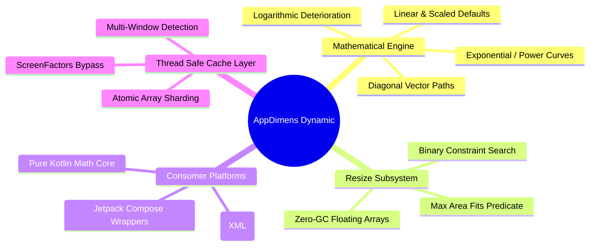

# Product Requirements Document (PRD) — AppDimens Dynamic

> [!NOTE]
> **Product Alignment:** `io.github.bodenberg:appdimens-dynamic:3.1.4`
> **Primary Module:** `library`
> **Associated Documents:** [PDR (Design)](PDR.md) | [Mathematics](MATHEMATICS-AND-CALCULUS.md) | [API Conventions](COMPOSE-API-CONVENTIONS.md)

## 1. Executive Summary

**AppDimens Dynamic** is a mathematical scaling engine designed for Android (`com.appdimens.dynamic`). Its purpose is to map generic UI dimensions (developed against a `300dp` or equivalent reference) to physical hardware parameters—scaling elegantly across phones, tablets, and unpredictable foldables.

It encapsulates **14 discrete mathematical scaling strategies** (curves), alongside an autonomous **Resize/Constraint subsystem** that calculates the maximum bounded element size at runtime via binary search.

## 2. Market Context & Problem Space

Static `dp` measurements fall apart as device variety increases. A `300dp` horizontal card fits perfectly on a classic phone but becomes aggressively small on high-density tablets or wide-screen foldables.

### Core Objectives
1. **Mathematical Consistency:** Provide reproducible scaling curves (Linear, Logarithmic, Factorial/Power).
2. **Unified Surface APIs:** Symmetrical integration rules for both Jetpack Compose (`compose.*`) and legacy XML/Views (`code.*`).
3. **High-Frequency Performance:** Accommodate zero-allocation hot paths using lock-free architecture for smooth `60FPS` and `120FPS` rendering algorithms.
4. **Hardware Awareness:** Adapt directly to `Configuration`, Display aspect ratios, Multi-Window flags, and Context DPI.

---

## 3. Functional Architecture overview

---

## 4. Feature Requirements (FR)

### FR-0: Systemic Foundation & Architecture
- **FR-0.1 (Module Separation):** Each strategy must exist as an independent computational node. `compose.percent` cannot import `compose.power`.
- **FR-0.2 (Telemetry & Reading):** Raw dimensions must derive directly from `android.content.res.Configuration`.
- **FR-0.3 (Platform Parity):** All Compose API nodes (`*DpExtensions`) must explicitly feature symmetric `code` equivalents for legacy migration.

### FR-1: Dimension Mathematics & Curves
> [!TIP]
> The `Scaled` default curve remains optimal for generic UI development, specifically supporting aspect-ratio injection (`sdpa`, `sdpi`) for anti-distortion tuning.

| Strategy Class | Mathematical Goal | Expected Consumer Use Case |
|:---|:---|:---|
| **Scaled** (Default) | Linear geometry translation from basic `300dp` scale. | Baseline paddings, Standard containers. |
| **Logarithmic** | Fast early growth curve with heavy downstream damping. | Text geometries on massive tablets. |
| **Fluid** | Breakpoint-based linear interpolation \([320..768]\). | Responsive Web-like UI adjustments. |
| **Percent / Space** | Absolute device fractional limits (\( % \times sw \)). | Fixed grid splits, Nav bars. |
| **Interpolated** | User-defined N-point vector curves. | Brand-specific interactive scaling. |

### FR-2: Engine & Subsystem Resize Algorithms
- **FR-2.1 (Memory Integrity):** Generates constraint step buffers via static pre-allocated `FloatArray`. **No auto-boxing allowed.**
- **FR-2.2 (Processing):** Operates on an asymptotic \(\mathcal{O}(\log N)\) binary search protocol to match element sizing to physical screen limits.
- **FR-2.3 (Bounds & Safety):** Respect hardware metrics with `ResizeBound.resolveToPx` using strict `require(density > 0)` contracts.

---

## 5. Non-Functional Requirements (NFR)

* **NFR-1 (Performance Benchmarking):** Memory bypass mechanisms. The system expects that if aspect-ratio scaling is OFF on core types (`PERCENT`, `SCALED`), `getOrPut` reduces to a constant time single-multiply operation.
* **NFR-2 (Lock-Free Threading):** Uses `AtomicLongArray` / `AtomicIntegerArray` implementing a deterministic *last-write-wins* methodology preventing bottlenecking on ARM64.
* **NFR-3 (Minimum Environment):** `minSdk = 24`, Java 17 requirements, enforcing direct Proguard shipping via `consumer-rules.pro`.
* **NFR-4 (Runtime Diagnostics):** Engine observability functions remain conditionally gated (`diagnosticsEnabled`) to eliminate tracing overhead in production applications.

## 6. Metrics of Success
1. Integration on both Compose/XML environments without memory/GC stuttering.
2. Binary scale operations taking `< 15ns` median time.
3. Successful scaling to multi-window split structures automatically.
