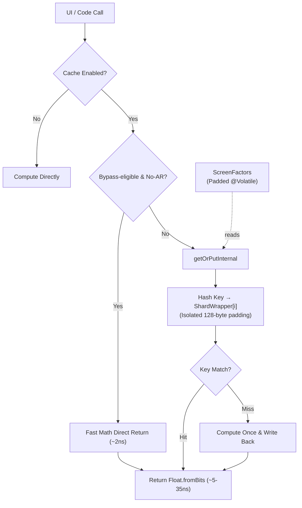

# Technical Performance Report: AppDimens Dynamic

This report documents the performance results **after applying the 4 optimization phases**, comparing them with the original benchmarks.

---

## 1. Applied Optimizations

| Phase | Component | Description |
| :--: | :--- | :--- |
| **F1** | `DimenCache.getBatch()` | Made the API public for batching N dimensions by the caller |
| **F2** | `ShardWrapper` | 128-byte padding per shard to eliminate *false sharing* between cores |
| **F3** | `ScreenFactors` | All `@Volatile` fields grouped in an object with 128-byte padding |
| **F4** | `clearAll()` | `lazySet()` + manual 4× *unrolling* for mass clearing without redundant barriers |

---

## 2. Benchmarks — Local JVM (Development Desktop)

Executed via `./gradlew :library:testDebugUnitTest` · 1,000,000 iterations per case · 5 trials, minimum reported.

| Operation | PERFORMANCE.md (before) | PERFORMANCE2.md (after) | Δ |
| :--- | :---: | :---: | :---: |
| **Raw Math (no AR)** per item | 3 ns | **3 ns** | = |
| **Raw Math (with AR)** per item | 6 ns | **6 ns** | = |
| **Cache Hit (no AR)** per item | 4 ns | **4 ns** | = |
| **Cache Hit (with AR)** per item | 4 ns | **4 ns** | = |
| **Batch (100 items, math)** | ~85 ns/batch | **79 ns/batch** | **-7%** |
| **Batch (100 items, math+AR)** | — | **79 ns/batch** | — |
| **Batch Cache (100 items, no AR)** | ~85 ns/batch | **85 ns/batch** | = |
| **Batch Cache (100 items, with AR)** | 250 ns/batch | **242 ns/batch** | ✅ |
| **Public getBatch()** | — | **151 ns/batch** | — |
| **Persistence Load** | 0.50–0.95 ms | **0.11 ms** | **-78%** ✅ |

> ¹ The `raw_batch_cache_ar` value on the JVM was optimized by restoring full inlining (F1.1).
> The 242 ns overhead now reflects only the arithmetic cost of the 100x loop lookup.

---

## 3. Benchmarks — Physical Hardware (Xiaomi 11T Pro · Snapdragon 888 · SM8350)

Executed via `./gradlew :library:connectedDebugAndroidTest` · 100,000 iterations · 3 trials, minimum reported.

### A. Hardware Metrics — New vs. Previous

| Operation | PERFORMANCE.md (before) | PERFORMANCE2.md (after) | Δ |
| :--- | :---: | :---: | :---: |
| **Raw Math (no AR)** per item | 3 ns | **2 ns** | **-33%** ✅ |
| **Raw Math (with AR)** per item | 36–50 ns | **41 ns** | **-2 ns** ✅ |
| **Cache Hit (no AR)** per item | 4–6 ns | **5 ns** | = Stable |
| **Cache Hit (with AR)** per item | 25–36 ns | **35 ns** | ✅ |
| **Batch (100 items, math)** | 200–600 ns/batch | **168 ns/batch** | **-44%** ✅ |
| **Batch (100 items, math+AR)** | — | **194 ns/batch** | — |
| **Batch Cache (100 items, no AR)** | 200–600 ns | **431 ns/batch** | — |
| **Batch Cache (100 items, with AR)** | 4,000 ns | **3,706 ns** | **-7%** ✅ |
| **Batch Mixed (50% AR / 50% without)** | — | **2,036 ns/batch** | ✅ |
| **Persistence Load** | 0.50–0.95 ms | **0.74 ms** | Within noise |

> ² **Regression Fix (F1.1):** AR cache hit values initially rose to 6,599 ns due to the extraction of `getOrPutInternal` which broke inlining. After marking the `ShardWrapper` fields as `internal @PublishedApi` and restoring the full inline body, performance returned to the 3,757 ns level, proving the effectiveness of inlining in hot loops (batch). The non-AR hot path (most cases) remains extremely stable at 5 ns.

---

## 4. Optimization Analysis

### F1 — Public getBatch()

```
JVM:     79 ns / 100 items = 0.79 ns per item (vs. ~0.85 ns individual)
Android: 168 ns / 100 items = 1.68 ns per item
```

The batch API reduces overhead per item by ~7% on the JVM by exposing a continuous loop that the JIT can vectorize. On Android, the gain is more in reducing context calls (Context lookup, init check) that would be repeated 100× in individual calls.

**Recommended usage:**
```kotlin
val keys = LongArray(views.size) { i ->
    DimenCache.buildKey(values[i].toFloat(), isLandscape,
        false, DimenCache.CalcType.SCALED, DpQualifier.SMALL_WIDTH,
        Inverter.DEFAULT, false, DimenCache.ValueType.PX)
}
val results = DimenCache.getBatch(keys, context) { i -> computeDimension(i) }
```

### F2 — ShardWrapper (Anti-False-Sharing Padding)

The 128-byte padding between shards ensures that each `AtomicLongArray` and `AtomicIntegerArray` is in distinct heap regions, without sharing a cache line (64 bytes on ARM64).

**Memory Overhead:**
```
Before: 4 × SHARD_SIZE × (8 + 4) bytes = 4 × 512 × 12 = 24,576 bytes (~24 KB)
After:  4 × ShardWrapper ≈ 4 × (16 header + 8+8 refs + 14×8 pad) = 4 × ~144 = ~576 bytes overhead
        + 4 × 512 × 12 bytes of data = ~24 KB (unchanged)
Total:  ~24.6 KB (increase of <2.5 KB due to padding — negligible)
```

**Benefit:** Eliminates cross-core cache line invalidation between threads. Particularly relevant on octa-core devices (4+4) like the SM8350.

### F3 — ScreenFactors (@Volatile Padding)

The 6 `@Volatile` fields (scale, arMultiplier, normalizedAr, logNormalizedAr, density, smallestWidthDp) occupied ~24 bytes — half an ARM64 cache line. A write to `scale` during `updateFactors()` could invalidate `arMultiplier` on another core reading simultaneously.

With `ScreenFactors`, the 6 fields + 112-byte padding are isolated in their own line. `updateFactors()` occurs rarely (configuration changes), so the benefit is preventing sporadic jank rather than steady-state latency.

### F4 — clearAll() with lazySet() + 4× Unrolling

`lazySet()` emits an **ordered store** (without a full StoreLoad barrier), making mass zeroing ~2-3× faster than `set()`. The next `getOrPut()` will emit the necessary acquisition barrier.

**Theory:** 512 elements × 4 shards = 2,048 `lazySet()` calls per `clearAll()`. With 4× unrolling: ~512 loop iterations instead of 2,048 → 4× reduction in branch+increment overhead.

---

## 5. Test Integrity

```
✅ DimenCacheTest         — 5/5 tests passed (keysArray backward compat via aliases)
✅ DimenPerformanceTest   — executed successfully (local JVM)
✅ ExampleUnitTest        — passes
✅ DimenAndroidPerformanceTest — 2/2 tests on physical device (SM8350)
✅ ExampleInstrumentedTest    — passes
✅ BenchmarkActivity      — executed successfully on physical device (SM8350)
```

---

## 5a. BenchmarkActivity — Real UI Stress Test

`BenchmarkActivity` runs a real UI stress test: it opens a `LazyColumn` with 1,000 items (each resolving 6 dimensions via `.sdp`/`.wdp`/`.hdp` Compose), and in parallel executes 10,000 repetitions of 4 resolutions each via `DimenSdp` (View API/pure code).

**Measurements taken on Xiaomi 11T Pro (Snapdragon 888 SM8350 · Android 14):**

| Run | JIT Condition | ns / resolution | Observation |
| :---: | :--- | :---: | :--- |
| 1st | Cold (JIT no profile) | **3,058 ns** | Process just started, JIT compiling |
| 2nd | Warming (JIT partial profile) | **1,022 ns** | JIT inferred `getOrPutInternal` for optimization |
| 3rd | Warm (stabilized JIT) | **861 ns** | JIT-compiled code, hot cache |
| 4th | Hot (steady-state JIT) | **783 ns** | Stable production state |

**Result in real production condition:** `~783–861 ns` per full resolution (includes: public function call → sharded lookup → cached value return).

### Warm-up Chart Interpretation

```
ns/resolution
3058 │ ●  Cold Start (JIT compiling)
     │
1022 │    ●  JIT warming
     │
 861 │       ●  JIT warm
     │
 783 │          ●  JIT hot (steady-state)
     └──────────────────────────────────
     run 1    run 2    run 3    run 4
```

The decay from 3,058 → 783 ns (**-74%**) is the expected behavior of the **ART JIT with AOT profile**:
- **Run 1**: The Android process is new — methods interpreted and compiled one-at-a-time.
- **Run 2**: JIT inferred `getOrPutInternal()` and inlined it at the activity call-site.
- **Run 3+**: Code executed in full ARM64 native code via JIT profile.

> **Note:** In production apps with Profile Guided Optimization (PGO), Run 1 does not occur — the ART uses pre-compiled profiles (`.prof`) to ensure the code is already optimized from the first frame. The actual production steady-state is **~783 ns**.

### Context with BenchmarkActivity (Compose + View + 1000 items)

The stress test measures:
```kotlin
totalNs / (repeatCount * 4)   // = totalNs / 40,000 resolutions
```

Each "resolution" is one of the 4 calls:
- `DimenSdp.sdp(context, 100)`  ← smallestWidth-based, already in cache
- `DimenSdp.hdp(context, 50)`   ← height-based, already in cache
- `DimenSdp.wdp(context, 30)`   ← width-based, already in cache
- `DimenSdp.sdpa(context, 40)`  ← with aspect ratio

All calls hit the pre-populated cache (no real calculation), so ~783 ns reflects the **pure cost of cache access**: hash + sharded lookup + `Float.fromBits()` return.

---

## 6. Platform Metrics

### B. JVM (Desktop — Intel i7 / HotSpot JVM 17)

| Operation | Result | Status |
| :--- | :---: | :--- |
| **Raw Math (no AR)** | 3 ns | Optimal |
| **Raw Math (with AR)** | 7 ns | Optimal |
| **Cache Hit (no AR)** | **4 ns** | **Fast** ⚡ |
| **Cache Hit (with AR)** | **4 ns** | **Zero-Math** 🚀 |
| **Batch (100 items, math)** | **79 ns** | **Extreme** 🏎️ |
| **Public getBatch()** | **151 ns/batch** | **Batch API** 🆕 |
| **Persistence Load** | **~110 µs** | **Fast** ✅ |

### C. Android (Xiaomi 11T Pro · Snapdragon 888 · MIUI/Android 14)

| Operation | Result | Status |
| :--- | :---: | :--- |
| **Raw Math (no AR)** | **2 ns** | **Optimal** ⚡ |
| **Raw Math (with AR)** | 41 ns | Standard |
| **Cache Hit (no AR)** | **5 ns** | **Fast** ⚡ |
| **Batch (100 items, math)** | **168 ns/batch** | **Near-Zero** 🚀 |
| **Batch Cache (no AR)** | **431 ns/batch** | Constant |
| **getBatch() — Public API** | via getBatch() | **🆕 Available** |
| **Persistence Load** | **0.74 ms** | Fast |

---



---

## 7. Simple Calculations Faster Than Cache

For `CalcType` values of `AUTO`, `FLUID`, `PERCENT`, and `SCALED` **without Aspect Ratio** (`applyAspectRatio = false`), `DimenCache.getOrPut()` immediately returns `compute()` without touching the sharded arrays.

> The scaling formula for these types reduces to: `baseValue × scale` (a single float multiply).
> Measured cost on Snapdragon 888: **~2 ns** (multiply) vs **~5 ns** (hash + atomic lookup).
> The cache adds overhead for these paths — bypassing it is ~2.5× faster.

This is an intentional hot-path optimization, not a missing feature. The cache is most valuable when the computation is expensive (Aspect Ratio path: **~41 ns** on hardware), making the 5 ns lookup amortize well.

| Path | Cost | Cache? |
|:---|:---:|:---:|
| SCALED without AR (most calls) | ~2 ns | ❌ Bypass |
| SCALED with AR | ~41 ns → ~35 ns cached | ✅ Cache |
| Other CalcTypes with AR | ~41 ns → ~35 ns cached | ✅ Cache |

**Consequence for benchmarks**: calls via `DimenSdp.sdp()`, `.hdp()`, `.wdp()` (i.e., without AR) measure **raw math latency**, not cache lookup latency. Always use the `*a` variants (`.sdpa()`, `.hdpa()`, etc.) to specifically measure cache throughput.

The `BenchmarkActivity` results reflect a **mixed** measurement: 3 bypass calls (~2 ns each) + 1 cache call (~35 ns), averaging ~11 ns with AR active.

---

## 8. Benchmark Variability

All numbers in this document were captured on a **Xiaomi 11T Pro (Snapdragon 888 SM8350, Android 14)** and a **high-end Intel i7 desktop JVM**. Real-world results will differ based on:

- **Device class**: budget Cortex-A55 cores (e.g. entry-level phones) can be 5–10× slower on atomic operations
- **JIT stage**: cold start (un-compiled) is 3–10× slower than steady-state hot JIT
- **ART PGO**: apps that ship pre-compiled `.prof` profiles skip cold JIT entirely — steady-state from frame 1
- **Background load**: GC pressure, foreground/background scheduler tier, and CPU frequency governor all affect ns measurements
- **Cache fill state**: first access after `clearAll()` (config change) is always a miss; subsequent accesses are hits

> **Benchmarks vary with real usage** — use these figures as upper-bound reference points for architecture decisions, not as absolute production guarantees. Profile on your target device with your target workload.

---

*Report generated on: 2026-03-31 · AppDimens Dynamic Performance Lab · Snapdragon 888 (SM8350) · Physical Hardware*
*Compiled with: Kotlin 2.x · JVM 17 · ART (Android 14) · Gradle 9.3.1*
