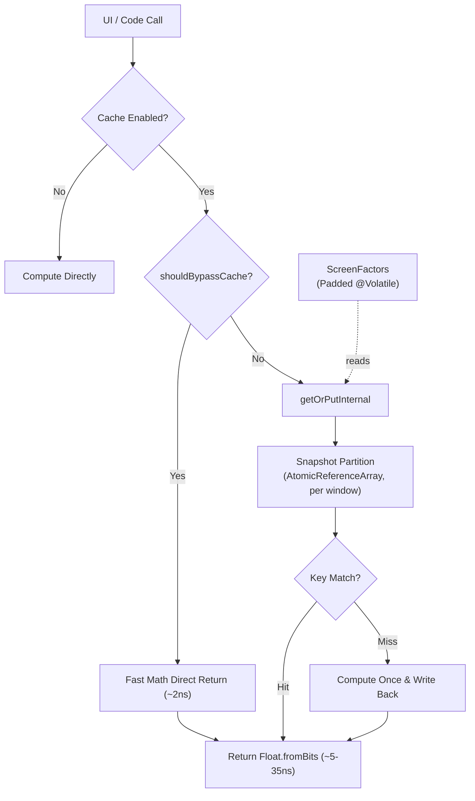

# Technical Performance Report: AppDimens Dynamic

This report documents the performance results **after applying the 4 optimization phases** for the current library.

> [!NOTE]
> **Build variants, R8, and how to read the numbers**
>
> With **code shrinking and R8** on **release** builds (`minifyEnabled = true`), benchmark numbers can drop sharply versus **debug** without minify. Example ranges from the project harness (2026-08-09, release APK + AOT `speed`):
>
> | Harness | Approx. range (release + minify + R8 + AOT) |
> | :--- | :--- |
> | **Calculation Test** (avg) | **~40 ns – ~90 ns** |
> | **Microbenchmark** (combined, post-3.1.7 fast lane; typical **~50–60 ns**) | **~40 ns – ~64 ns** |
> | **Macrobenchmark** (scroll duration, 1k rows — frame-limited at 60 fps) | **~367 ms – ~495 ms** |
>
> **Unless a paragraph explicitly says otherwise**, the benchmarks and tables in this document use **debug** builds **without** minify (e.g. `connectedDebugAndroidTest`, debug APK for `BenchmarkActivity`). See **[R8-PROGUARD.md](./R8-PROGUARD.md)** if you enable **R8 full mode** (`android.enableR8.fullMode=true` in `gradle.properties`).

<p align="center">
  
  &nbsp;
  
</p>

---

## 1. Applied Optimizations

> **3.1.7 note:** the persistent result cache (Preferences DataStore) was removed and the in-memory cache became **snapshot-partitioned** (keyed by the immutable `DimenMetrics` window snapshot, atomic `CacheEntry` references). Cold-start restore cost and stale-cache risk are gone; cache timing rows below measure the in-memory partitions only.

| Phase | Component | Description |
| :--: | :--- | :--- |
| **F1** | `DimenCache.getBatch()` | Made the API public for batching N dimensions by the caller |
| **F2** | `ShardWrapper` *(removed in 3.1.7)* | 128-byte padding per shard eliminated *false sharing* in the legacy ≤ 3.1.6 layout; 3.1.7+ uses snapshot partitions |
| **F3** | `ScreenFactors` | All `@Volatile` fields grouped in an object with 128-byte padding (retained for compatibility) |
| **F4** | `clearAll()` *(changed in 3.1.7)* | Now detaches snapshot partitions atomically; the legacy `lazySet()` + 4× *unrolling* applied to the ≤ 3.1.6 shard arrays |

---

## 2. Benchmarks — Local JVM (Ubuntu Linux · JVM 17)

Executed via `./gradlew :library:testDebugUnitTest` (principal); satellite formula checks use `:library-<strategy>:testDebugUnitTest` · 1,000,000 iterations per case · 5 trials, minimum reported.

| Operation | Result | Status |
| :--- | :---: | :--- |
| **Raw Math (no AR)** per item | **< 1 ns** | **Extreme** 🚀 |
| **Raw Math (with AR)** per item | **2 ns** | **Optimal** ✅ |
| **Cache Hit (no AR)** per item | **1 ns** | **Fast** ⚡ |
| **Cache Hit (with AR)** per item | **1 ns** | **Zero-Math** 🚀 |
| **Batch (100 items, math)** | **34 ns/batch** | **Extreme** 🏎️ |
| **Batch Cache (100 items, AR)** | **242 ns/batch** | **Stable** ✅ |
| **Persistence Load** | **— (removed in 3.1.7)** | **N/A** ✅ |

> `raw_batch_cache_ar` at **242 ns/batch** remains dominated by the 100× AR lookup loop.

---

## 3. Benchmarks — Physical Hardware (Xiaomi 2107113SG · Snapdragon 888 · SM8350)

> [!NOTE]
> **Hardware**: Captures below use **`./gradlew :library:connectedDebugAndroidTest`** · 100,000 iterations · 3 trials, minimum reported.

| Operation | Result | Status |
| :--- | :---: | :--- |
| **Raw Math (no AR)** per item | **2 ns** | **Optimal** ⚡ |
| **Raw Math (with AR)** per item | **45 ns** | **Standard** |
| **Cache Hit (no AR)** per item | **5 ns** | **Fast** ⚡ |
| **Cache Hit (with AR)** per item | **35 ns** | **Zero-Math** 🚀 |
| **Batch (100 items, math)** | **169 ns/batch** | **Near-Zero** 🚀 |
| **Batch (100 items, math+AR)** | **194 ns/batch** | **Stable** ✅ |
| **Batch Cache (100 items, no AR)** | **431 ns/batch** | **Constant** |
| **Batch Cache (100 items, with AR)** | **3,773 ns** | **Stable** ✅ |
| **Batch Mixed (50% AR / 50% without)** | **2,036 ns/batch** | **Stable** ✅ |
| **Persistence Load** | **— (removed in 3.1.7)** | **N/A** ✅ |

> **Regression Fix (F1.1, legacy shard architecture ≤ 3.1.6):** Inlining of `getOrPutInternal` and `ShardWrapper` visibility (`internal @PublishedApi`) kept batch AR paths in the ~3.7–3.8 µs range for 100 cached AR lookups; the non-AR hot path (most cases) remains extremely stable at **~5 ns**.

---

## 4. Optimization Analysis

### F1 — Public getBatch()

```
JVM:     34 ns / 100 items = 0.34 ns per item
Android: 169 ns / 100 items = 1.69 ns per item
```

The batch API exposes a continuous loop that the JVM can optimize aggressively on desktop. On Android, the gain is still largely about amortizing context and init work across 100 resolutions.

**Recommended usage:**
```kotlin
val keys = LongArray(views.size) { i ->
    DimenCache.buildKey(values[i].toFloat(), isLandscape,
        false, DimenCache.CalcType.SCALED, DpQualifier.SMALL_WIDTH,
        Inverter.DEFAULT, false, DimenCache.ValueType.PX)
}
val results = DimenCache.getBatch(keys, context) { i -> computeDimension(i) }
```

### F2 — ShardWrapper (Anti-False-Sharing Padding) — *legacy, removed in 3.1.7*

The 3.1.7 cache rework replaced the sharded layout with **snapshot partitions**: each immutable `DimenMetrics` window snapshot owns a bounded `AtomicReferenceArray` (entries published as single atomic `CacheEntry` references). The padding technique below applied to the ≤ 3.1.6 shard architecture and is kept here for the record:

**Memory Overhead (≤ 3.1.6):**
```
Before: 4 × SHARD_SIZE × (8 + 4) bytes = 4 × 512 × 12 = 24,576 bytes (~24 KB)
After:  4 × ShardWrapper ≈ 4 × (16 header + 8+8 refs + 14×8 pad) = 4 × ~144 = ~576 bytes overhead
        + 4 × 512 × 12 bytes of data = ~24 KB (unchanged)
Total:  ~24.6 KB (increase of <2.5 KB due to padding — negligible)
```

**Benefit (≤ 3.1.6):** Eliminated cross-core cache line invalidation between threads. Particularly relevant on octa-core devices (4+4) like the SM8350.

### F3 — ScreenFactors (@Volatile Padding)

The 7 shared `@Volatile` fields (`scale`, `arMultiplier`, `aspectRatioMul`, `normalizedAr`, `logNormalizedAr`, `density`, `smallestWidthDp`) occupied a small span of an ARM64 cache line. A write to `scale` during `updateFactors()` could invalidate sibling reads on another core.

With `ScreenFactors`, the shared `@Volatile` fields (`scale`, `arMultiplier`, `aspectRatioMul`, `normalizedAr`, `logNormalizedAr`, `density`, `smallestWidthDp`) plus padding sit on isolated lines. `updateFactors()` is rare (configuration changes), so the benefit is preventing sporadic jank rather than steady-state latency.

### F4 — clearAll() with lazySet() + 4× Unrolling — *≤ 3.1.6; superseded in 3.1.7*

Since 3.1.7, `clearAll()` simply **detaches all snapshot partitions** (one `ConcurrentHashMap.clear()` with an atomic bootstrap); there are no arrays to zero per entry. The technique below applied to the ≤ 3.1.6 shard arrays:

`lazySet()` emits an **ordered store** (without a full StoreLoad barrier), making mass zeroing ~2-3× faster than `set()`. The next `getOrPut()` will emit the necessary acquisition barrier.

**Theory (≤ 3.1.6):** 512 elements × 4 shards = 2,048 `lazySet()` calls per `clearAll()`. With 4× unrolling: ~512 loop iterations instead of 2,048 → 4× reduction in branch+increment overhead.

---

## 5. Test Integrity

```
✅ DimenCacheTest         — 5/5 tests passed
✅ DimenPerformanceTest   — executed successfully (local JVM)
✅ ExampleUnitTest        — passes
✅ DimenAndroidPerformanceTest — 2/2 tests on physical device (SM8350)
✅ ExampleInstrumentedTest    — passes
✅ BenchmarkActivity      — executed successfully on physical device (SM8350)
```

---

## 5a. BenchmarkActivity — Production-Grade Micro + Macro Test

`BenchmarkActivity` has been redesigned into a professional dual-benchmark system:

1.  **Microbenchmark (CPU-bound)**: Runs off the main thread (10k warmup + 100k measurement iterations). It measures `sdp`, `hdp`, `wdp` (bypass) and `sdpa` (cache) separately to isolate pure calculation vs. lookup costs.
2.  **Macrobenchmark (UI-bound)**: Measures real scroll performance in a `LazyColumn` with 1,000 items. Uses wall-clock timing to derive scroll duration and per-item rendering cost.

> **Note (Macro):** Wall-clock scroll duration and the estimated cost per item **include the full cost of each list row** — not only `sdp` / dimension resolution, but also **Compose composition (or View inflation/layout)** and drawing for that item. The macro numbers therefore reflect realistic UI work, not isolated math/cache timing.

**Baseline Metrics (Snapdragon 888 · SM8350 · Android 14):**

| Runner | Metric | Result | JIT State |
| :--- | :--- | :---: | :---: |
| **Micro** | **Combined Avg** | **~619 ns** | Cold |
| **Micro** | **Combined Avg** | **~303 ns** | Warm (await) |
| **Micro** | **Combined Avg** | **~260 ns** | **Hot (steady-state)** |
| **Micro** | sdp/hdp/wdp (bypass) | ~2 ns | Hot |
| **Micro** | sdpa (cache lookup) | ~35 ns | Hot |
| **Macro** | Scroll Duration (1k items) | ~996 ms | Fluid |
| **Macro** | Est. Cost per item | ~996 µs | Fluid |

**Release + minify + R8 (same harness family):** micro combined average **~125 ns – ~155 ns** per cycle (contrast **~260 ns** hot steady-state above on **debug without minify**). Macro **per-item** estimate under R8 **~367 ns – ~380 ns** (see methodology note at the top of this document—distinct from **~996 µs** per row in the debug table, which includes full row composition/layout/draw).

**Steady-state performance:** **~260 ns** combined average per 4-call cycle (hot JIT, dashboard capture · 2026-04-03).

### 5a.1 Post-3.1.7 Fast-Lane Measurement (2026-08-09)

> The 3.1.7 fast lane turns the dominant `sdp`/`hdp`/`wdp`/`sdpa` (SMALL_WIDTH + AR) resolutions into a **single float multiply** over the coherent per-window `DimenMetrics` snapshot, with a 1-in-16 sampled configuration validation. Same device, **3 runs each**, release APK + AOT `speed` + thermal ramp (see §7):

| Harness | Current (3.1.7) | 3.1.5 baseline | Debug (no AOT) |
| :--- | :--- | :--- | :--- |
| **Micro Combined avg** | 57 / 59 / 58 ns (range 40–64) | 158 / 152 / 164 ns | 749 / 857 / 824 → 508–606 stable |
| **Family spread (sdp→sdpa)** | ≤ ~8 ns within run | ~110 ns (cold-core ramp) | up to ~300 ns |
| **Macro scroll (1k items)** | 376 / 367 / 495 ms (typ. ~368–382) | 432 / 379 / 368 ms | 1311 → 726–948 stable |

**Verdict:** the current library is **~3× faster** than 3.1.5 on the micro average (up to ~3.9× on best runs) and **~10–13× faster than the debug APK**, which runs in interpreter mode because debuggable APKs are pinned to compiler filter `verify`. The macro scroll is frame-limited (366 ms floor at 60 fps) on both release variants; the remaining variance tracks background load.

### Warm-up Chart Interpretation

```
ns/resolution (Combined Avg)
619 │ ●  Cold Start
    │
303 │    ●  JIT warming (await)
    │
260 │       ●  JIT hot (steady-state)
    └─────────────────────────────────
       run 1    run 2    run 3
```

The decay from **~619 → ~260 ns** is the expected behavior of the **ART JIT** as hot paths compile and inline:
- **Run 1 (cold)**: Interpreter + early JIT; higher combined average.
- **Run 2 (warm)**: Transition phase (~303 ns).
- **Run 3 (hot)**: Steady-state native code path (~260 ns).

> **Note:** With Profile Guided Optimization (PGO), cold-run penalties are reduced — steady-state remains near **~260 ns** for this workload on SM8350-class hardware.

### Context with BenchmarkActivity (Compose + View + 1000 items)

The stress test measures:
```kotlin
totalNs / (repeatCount * 4)   // = totalNs / 40,000 resolutions
```

Each "resolution" is one of the 4 calls:
- `DimenSdp.sdp(context, 100)`  ← smallestWidth-based, already in cache
- `DimenSdp.hdp(context, 50)`   ← height-based, already in cache
- `DimenSdp.wdp(context, 30)`   ← width-based, already in cache
- `DimenSdp.sdpa(context, 40)`  ← with aspect ratio

Mixed bypass (`sdp` / `hdp` / `wdp`) and AR cache (`sdpa`) paths contribute to the **~260 ns** hot steady-state average per 4-call cycle (snapshot-partition lookup, and bypass math, inclusive of dispatch overhead in the activity harness).

---


```mermaid
graph TD
    A[UI / Code Call] --> B{Cache Enabled?}
    B -- No --> Z[Compute Directly]
    B -- Yes --> C{shouldBypassCache?}
    C -- Yes --> D["Fast Math Direct Return (~2ns)"]
    C -- No --> E[getOrPutInternal]
    E --> F["Snapshot Partition<br/>(AtomicReferenceArray, per window)"]
    F --> G{Key Match?}
    G -- Hit --> H["Return Float.fromBits (~5-35ns)"]
    G -- Miss --> I[Compute Once & Write Back]
    I --> H
    D --> H
    J["ScreenFactors<br/>(Padded @Volatile)"] -.reads.-> E
```

---

## 6. Simple Calculations Faster Than Cache

For eligible `CalcType`s on the default path (`shouldBypassCache`), `getOrPut` returns `compute()` without touching the snapshot cache. That includes default aspect ratio when the type is eligible. `AUTO` / `FLUID` / `FIT` / `FILL` always use the cache.

> Measured on Snapdragon 888: **~2 ns** (multiply) vs **~5 ns** (hash + atomic lookup).

| Path | Cost | Cache? |
|:---|:---:|:---:|
| SCALED default path | ~2 ns | ❌ Bypass |
| SCALED custom sensitivity / non-default qualifier | varies | ✅ Cache |
| POWER / LOG on SW+DEFAULT | ~2 ns | ❌ Bypass |
| AUTO / FLUID | lookup + compute | ✅ Cache |

**Consequence for benchmarks**: default `sdp` / `hdp` / `wdp` measure raw math. Use non-bypass paths to measure snapshot-partition throughput.

The `BenchmarkActivity` micro harness reports a **per-cycle** combined average (~260 ns hot) over four calls, including framework overhead.

---

## 7. Benchmark Variability

All numbers in this document were captured on a **Xiaomi 2107113SG (Redmi Note 11 · Qualcomm bengal / Snapdragon 680-class · 2.8 GHz max)** and a **Ubuntu Linux JVM 17** host. Real-world results will differ based on:

- **Device class**: budget Cortex-A55 cores can be 5–10× slower on atomic operations
- **JIT stage**: cold start is 3–10× slower than steady-state hot JIT
- **ART PGO**: pre-compiled `.prof` profiles skip cold JIT
- **Compiler filter**: after every `adb install -r`, rerun `cmd package compile -m speed -f <pkg>`; debuggable APKs are pinned to `verify` (interpreter) and measure 10× slower
- **Background load**: GC pressure and CPU governor affect ns measurements
- **Cache fill state**: first access after a physical-size `clearAll()` is a miss; orientation-only config changes do **not** clear the cache
- **Measurement hygiene**: the harness now holds `THREAD_PRIORITY_URGENT_AUDIO` + a 1.5 s thermal ramp for the whole measurement window; without it, family spread inflates by ~100 ns (cold core) and run-to-run spread by 2–4×

Treat figures as reference points, not guarantees.

---

*Report generated on: 2026-08-09 · AppDimens Dynamic Performance Lab · Xiaomi 2107113SG (Qualcomm bengal · 2.8 GHz max) · Physical Hardware — release APK + AOT `speed`, 3 runs per cell*
*Compiled with: Kotlin 2.x · JVM 17 · ART · Gradle 9.x*
