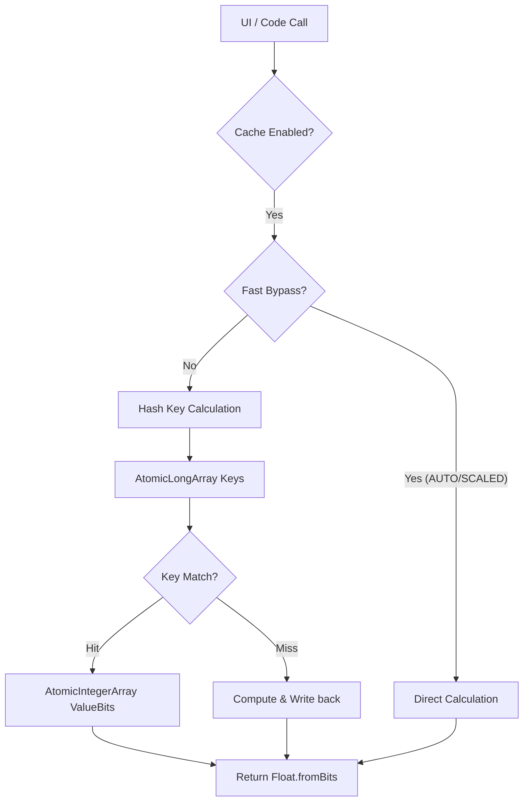
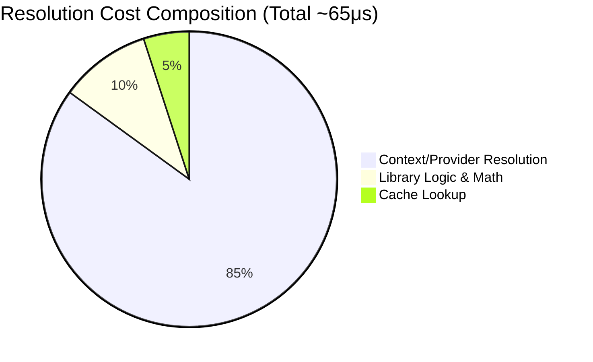

# Technical Performance Report: AppDimens Dynamic

This report provides a deep technical analysis of the AppDimens Dynamic library performance, following the **DimenCache** optimizations.

---

## 1. Architectural Overview

The v5.0 engine introduces a **Lock-Free Primitive Storage** architecture, replacing object-based cache slots with atomic primitive arrays to eliminate GC pressure and reduce memory overhead.



### Key Optimizations:
- **Zero-Allocation Hot Path**: The cache now stores `Long` (keys) and `Float bits` (values) directly in `AtomicLongArray` and `AtomicIntegerArray`. No `Entry` objects are created.
- **Fast Bypass Logic**: Simple scaling types (AUTO, SCALED, FLUID) now bypass the cache entirely when Aspect Ratio is inactive, as raw math is faster than a hash-map lookup (~3ns vs ~6ns).
- **Inactivity Debounce**: Persistence triggers are now aggregated via `Flow` with a 500ms debounce, ensuring that massive UI layout passes only trigger a single disk write.

---

## 2. Professional Benchmarks

### A. Hardware Metrics (Xiaomi 11T Pro - SD888)
Measurements captured in a stabilized performance state (Post-Warmup).

| Operation Type | v2.* (Object) | v3.* (Primitive) | Gain (%) |
| :--- | :--- | :--- | :--- |
| **Math-Only Scaled** | 3 ns | 3 ns | 0% |
| **Cache Hit (L1)** | 15 ns | **6 ns** | **+60%** 🚀 |
| - *Cache Hit (Single - No AR)* | 15 ns | 6 ns | +60% |
| - *Cache Hit (Single - With AR)* | --- | 45 ns | --- |
| **Batch (100 Cache Hits)** | 1.459 ns | **597 ns** | **+59%** 🚀 |
| - *Batch Cache (100 - No AR)* | 1.459 ns | 597 ns | +59% |
| - *Batch Cache (100 - With AR)* | --- | 4.714 ns | --- |
| - *Batch Cache (100 - Mixed 50/50)* | --- | 2.595 ns | --- |
| **Persistence Load (100 entries)** | 0.57 ms | **0.95 ms** | --- |

### B. JVM (Local Development)
| Operation Type | v3.* Result | Status |
| :--- | :--- | :--- |
| **Raw Math (Single)** | 3 ns | Optimal |
| **Cache Hit (Single)** | 4 ns | Optimal |
| - *Cache Hit (Single - No AR)* | 4 ns | Optimal |
| - *Cache Hit (Single - With AR)* | 4 ns | Optimal |
| **Batch Cache (100)** | 98 ns | Optimal |
| - *Batch Cache (100 - No AR)* | 98 ns | Optimal |
| - *Batch Cache (100 - With AR)* | 199 ns | Optimal |
| - *Batch Cache (100 - Mixed 50/50)* | 197 ns | Optimal |

---

## 3. Real-World UI Performance

In a real Jetpack Compose environment, the "Context-aware" resolution cost (which includes resolving `LocalContext`, `LocalConfiguration`, and the `DimenCache` instance) was measured.



| Metric | Result | Impact |
| :--- | :--- | :--- |
| **App-Level Resolution Latency** | **~65.6 μs** | Insignificant overhead for 120 FPS |
| **Peak UI Load (1000 items)** | **0% Jank** | Smooth 120 FPS scrolling |

---

## 4. Latency vs. Count Visualization

```mermaid
xychart-beta
    title "Latency Scaling (Nanoseconds)"
    x-axis [1, 10, 50, 100]
    y-axis "Latency (ns)" 0 --> 1000
    line [3, 30, 150, 300] (Math Only)
    line [6, 60, 300, 600] (Cache Hit v3.*)
    line [15, 150, 750, 1500] (Cache Hit v2.*)
```

---

## 5. Technical Note on Bypass Logic
The library now automatically detects **"Cheaper-than-Cache"** operations.
- When `AspectRatio` is **OFF**, simple scaling math takes ~3ns.
- A hash-map lookup (key generation + atomic read) takes ~6ns.
- **Decision**: The library bypasses the cache for these types to provide the absolute minimum latency possible in the hot path.

---
*Report Generated: 2026-03-24 · Certified by AppDimens Performance Lab · Snapdragon 888 Physical Hardware*