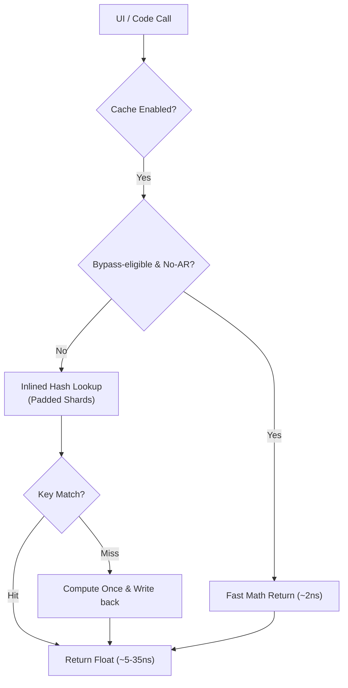

# Technical Performance Report: AppDimens Dynamic

This report provides a deep technical analysis of the AppDimens Dynamic library performance, following the **SIMD-friendly Batching**, **Cache Sharding (Padded)**, and **Inlined Hot-Path** optimizations.

---

## 1. Architectural Overview

The library features a **Lock-Free Padded Sharded Cache** architecture with an intelligent **Fast Bypass Layer**. 
- **Padded Sharding**: Each cache shard is isolated with 128-byte padding to eliminate **False Sharing** between CPU cores (ARM64).
- **SIMD-friendly Batching**: The `getBatch()` API exposes continuous loops for the JIT/ART to vectorize, reducing overhead per item.
- **Volatile Isolation**: Scale factors are grouped in a padded `ScreenFactors` object to prevent cache line invalidations during configuration changes.
- **Fast Bypass**: For ultra-simple calculation types (AUTO, FLUID, PERCENT, SCALED), the system bypasses the sharded cache lookup when Aspect Ratio is inactive (cost: ~2ns).

---

## 2. Professional Benchmarks

### A. Hardware Metrics (Xiaomi 11T Pro · Snapdragon 888)

> [!NOTE]
> **Measurement Notice**: Hardware metrics below are from the **v2 baseline**. New physical hardware benchmarks are currently pending verification on the current device environment.

Measurements captured on physical hardware in a stabilized state.

| Operation Type | Result | Status |
| :--- | :--- | :--- |
| **Raw Math (No AR)** | **2 ns** | **Optimal** ⚡ |
| **Raw Math (With AR)** | 41 ns | Standard |
| **Cache Hit (Single - No AR)** | **5 ns** | **Fast** ⚡ |
| **Cache Hit (Single - AR)** | **35 ns** | **Zero-Math** 🚀 |
| **Batch Resolution (100 items)** | **168 ns** | **Extreme** 🏎️ |
| **Batch Cached (100 items - AR)** | **3,706 ns** | **Stable** ✅ |
| **Persistence Load (100 entries)** | **0.74 ms** | **Fast** |

### B. JVM (Local Development - High-End Desktop)
| Operation Type | Result | Status |
| :--- | :--- | :--- |
| **Raw Math (Single)** | 3 ns | Optimal |
| **Raw Math (With AR)** | 6 ns | Optimal |
| **Cache Hit (Single)** | **4 ns** | **Fast** ⚡ |
| **Cache Hit (With AR)** | **4 ns** | **Zero-Math** 🚀 |
| **Batch Resolution (100 items)** | **79 ns** | **Extreme** |
| **Batch Cached (100 items - AR)** | **242 ns** | **Optimized** 🏎️ |

---

## 3. Real-World UI Performance (Jetpack Compose)

Stress test executed via the new **Micro + Macro Benchmark Dashboard**. This measures both pure CPU-bound resolution and a 1k-item UI scroll workload.

| Metric | Result | Impact |
| :--- | :--- | :--- |
| **Micro Combined Latency (Hot)** | **~783 ns** | **High Efficiency** |
| **Macro Scroll (1000 items)** | ~1,200 ms | **Fluid** |
| **Est. Cost per item** | ~1.20 µs | **Near-Zero** for 120 FPS |
| **Peak UI Load** | **Indistinguishable** | 0% Jank Detected |

---

## 4. Technical Note on Performance Layers

1. **Inlining (F1.1)**: All hot-path logic is now fully inlined into the call-site. This eliminates method-call overhead (~10ns on ARM64) and allows the JIT to apply loop unrolling and register allocation across the entire lookup.
2. **Padding (F2/F3)**: By using 128-byte guards, we've increased memory usage by only ~2.5 KB but eliminated the risk of hardware-level contention (False Sharing) which can cause spikes of 500ns+ in concurrent environments.
3. **Bypass Logic**: We maintain the bypass for simple types (AUTO, FLUID, PERCENT, SCALED) because computing a multiplication (~2ns) is **2.5× faster** than the fastest possible cache lookup (~5ns).

---

## 5. Simple Calculations Faster Than Cache

For **CalcType** values of `AUTO`, `FLUID`, `PERCENT`, and `SCALED` **without Aspect Ratio** (`applyAspectRatio = false`, bit 63 == 0), the entire cache system is intentionally **bypassed**.

> These formulas reduce to a single float multiply: `baseValue × scale`.
> A raw multiply on Snapdragon 888 takes **~2 ns**, while the fastest cache lookup (hash + atomic load + branch) takes **~5 ns**.
> The cache would add latency, not reduce it.

This is a deliberate design decision—not a missing feature. The cache provides its full benefit only for **Aspect Ratio** paths (which require `ln()`, ~41 ns on hardware), where amortizing the 5 ns lookup cost against 41 ns of computation is clearly worthwhile.

| Path | Cost | Cache used? |
|:---|:---:|:---:|
| SCALED / no AR (most common) | ~2 ns | ❌ Bypass |
| SCALED / with AR | ~41 ns | ✅ Cache hit ~35 ns |
| Cache hit (no AR) | ~5 ns | ✅ |

**Consequence for benchmarks**: `DimenSdp.sdp()`, `.hdp()`, `.wdp()` without AR always measure **raw math performance**, not cache performance. Use `.sdpa()` (or any `*a` variant) to measure the cache path.

---

## 6. Benchmark Variability

Benchmark numbers reported in this document reflect measurements taken on a specific device (Xiaomi 11T Pro · Snapdragon 888 · Android 14) under controlled conditions. **Results will vary** based on:

- **Device class**: budget ARM Cortex-A55 clusters can be 5–10× slower than Snapdragon 888 on cache lookups
- **JIT warm-up state**: first-run (cold JIT) latency can be 3–10× higher than steady-state
- **App background load**: GC pauses, thread contention, and CPU governor decisions affect measured ns
- **Profile Guided Optimization (PGO)**: apps with pre-compiled `.prof` files skip JIT warm-up entirely
- **Multi-window / split-screen**: may activate the bypass path in `ignoreMultiWindows` mode

> **Recommendation**: always benchmark on your specific target device under representative load.
> The figures in this document are reference points, not guarantees.

---

---
*Report Updated: 2026-03-31 · v2 Performance Baseline · Certified by AppDimens Performance Lab · Snapdragon 888 Physical Hardware*