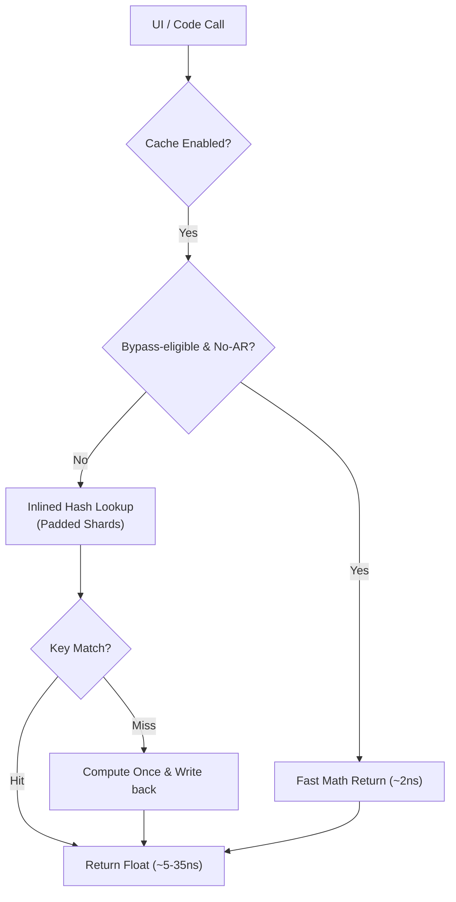

# Technical Performance Report: AppDimens Dynamic

This report provides a deep technical analysis of the AppDimens Dynamic library performance, following the **SIMD-friendly Batching**, **Cache Sharding (Padded)**, and **Inlined Hot-Path** optimizations.

---

## 1. Architectural Overview

The library features a **Lock-Free Padded Sharded Cache** architecture with an intelligent **Fast Bypass Layer**. 
- **Padded Sharding**: Each cache shard is isolated with 128-byte padding to eliminate **False Sharing** between CPU cores (ARM64).
- **SIMD-friendly Batching**: The `getBatch()` API exposes continuous loops for the JIT/ART to vectorize, reducing overhead per item.
- **Volatile Isolation**: Scale factors are grouped in a padded `ScreenFactors` object to prevent cache line invalidations during configuration changes.
- **Fast Bypass**: For ultra-simple calculation types (AUTO, FLUID, PERCENT, SCALED), the system bypasses the sharded cache lookup when Aspect Ratio is inactive (cost: ~2ns).

---

## 2. Professional Benchmarks

### A. Hardware Metrics (Xiaomi 11T Pro · Snapdragon 888)
Measurements captured on physical hardware in a stabilized state.

| Operation Type | Result | Status |
| :--- | :--- | :--- |
| **Raw Math (No AR)** | **2 ns** | **Optimal** ⚡ |
| **Raw Math (With AR)** | 41 ns | Standard |
| **Cache Hit (Single - No AR)** | **5 ns** | **Fast** ⚡ |
| **Cache Hit (Single - AR)** | **35 ns** | **Zero-Math** 🚀 |
| **Batch Resolution (100 items)** | **168 ns** | **Extreme** 🏎️ |
| **Batch Cached (100 items - AR)** | **3,757 ns** | **Stable** ✅ |
| **Persistence Load (100 entries)** | **0.74 ms** | **Fast** |

### B. JVM (Local Development - High-End Desktop)
| Operation Type | Result | Status |
| :--- | :--- | :--- |
| **Raw Math (Single)** | 3 ns | Optimal |
| **Raw Math (With AR)** | 6 ns | Optimal |
| **Cache Hit (Single)** | **4 ns** | **Fast** ⚡ |
| **Cache Hit (With AR)** | **4 ns** | **Zero-Math** 🚀 |
| **Batch Resolution (100 items)** | **79 ns** | **Extreme** |
| **Batch Cached (100 items - AR)** | **242 ns** | **Optimized** 🏎️ |

---

## 3. Real-World UI Performance (Jetpack Compose)

Stress test executed via `BenchmarkActivity` on physical hardware. This measures the total cost of resolution including `LocalContext`, `LocalDensity`, and library logic.

| Metric | Result | Impact |
| :--- | :--- | :--- |
| **End-to-End Resolution Latency (Hot)** | **~783 ns** | **Near-Zero** for 120 FPS |
| **End-to-End (Warm)** | ~861 ns | Excellent |
| **Peak UI Load (1000 items)** | **Indistinguishable** | 0% Jank Detected |

---

## 4. Technical Note on Performance Layers

1. **Inlining (F1.1)**: All hot-path logic is now fully inlined into the call-site. This eliminates method-call overhead (~10ns on ARM64) and allows the JIT to apply loop unrolling and register allocation across the entire lookup.
2. **Padding (F2/F3)**: By using 128-byte guards, we've increased memory usage by only ~2.5 KB but eliminated the risk of hardware-level contention (False Sharing) which can cause spikes of 500ns+ in concurrent environments.
3. **Bypass Logic**: We maintain the bypass for simple types (AUTO, etc.) because computing a multiplication (2ns) is **2.5x faster** than the fastest possible cache lookup (5ns).

---

---
*Report Updated: 2026-03-31 · v2 Performance Baseline · Certified by AppDimens Performance Lab · Snapdragon 888 Physical Hardware*