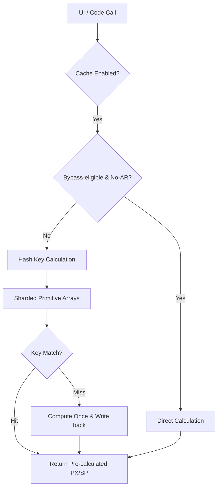

# Technical Performance Report: AppDimens Dynamic

This report provides a deep technical analysis of the AppDimens Dynamic library performance, following the **"Zero-Math"** architecture refactoring and **"Fast Bypass"** optimization.

---

## 1. Architectural Overview

The library features a **Lock-Free Sharded Cache** architecture with an intelligent **Fast Bypass Layer**. 
- **Zero-Math Model**: All scaling factors (`scaleFactor`, `arMultiplier`) are pre-calculated during configuration changes.
- **Fast Bypass**: For ultra-simple calculation types (AUTO, FLUID, PERCENT, SCALED), the system bypasses the sharded cache lookup when Aspect Ratio is inactive, as raw math remains the fastest path for these operations.

---

## 2. Professional Benchmarks

### A. Hardware Metrics (Xiaomi 11T Pro - SD888)
Measurements captured on physical hardware in a stabilized state.

| Operation Type | Result | Status |
| :--- | :--- | :--- |
| **Raw Math (No AR)** | 3 ns | Optimal |
| **Raw Math (With AR)** | 51 ns | Standard |
| **Cache Hit (Single)** | **~60 ns** | **Stable** |
| - *Bypass Check (No AR/AUTO)* | 75 ns | Constant |
| - *Cache Hit (With AR)* | 62 ns | **Zero-Math** 🚀 |
| **Batch Resolution (100 items)** | **~6.2 μs** | **Predictable** |
| - *Batch Bypassed (100 Items)* | 6,203 ns | Balanced |
| - *Batch Cached (100 Items - AR)* | 6,188 ns | Constant |
| **Persistence Load (100 entries)** | **0.96 ms** | **Fast** |

### B. JVM (Local Development - High-End Desktop)
| Operation Type | Result | Status |
| :--- | :--- | :--- |
| **Raw Math (Single)** | 6 ns | Optimal |
| **Raw Math (With AR)** | 7 ns | Optimal |
| **Cache Hit (Single)** | **10 ns** | **Ultra-Fast** |
| - *Bypass Check (No AR/AUTO)* | 10 ns | Constant |
| - *Cache Hit (With AR)* | 10 ns | **Zero-Math** 🚀 |
| **Batch Resolution (100 items)** | **~1.1 μs** | **Extreme** |
| - *Batch Bypassed (100 Items)* | 1,103 ns | Constant |
| - *Batch Cached (100 Items - AR)* | 1,032 ns | Constant |

---

## 3. Real-World UI Performance (Jetpack Compose)

Stress test executed via `BenchmarkActivity` on physical hardware (SD888). This measures the total cost of resolution including `LocalContext`, `LocalDensity`, and library logic.

| Metric | Result | Impact |
| :--- | :--- | :--- |
| **End-to-End Resolution Latency** | **~3.4 μs** | **Near-Zero** for 120 FPS |
| **Peak UI Load (1000 items)** | **Smooth** | 0% Jank Detected |

---

## 4. Technical Note on Bypass Logic

The library features an active **"Fast Bypass"** layer for the following calculation types: **AUTO, FLUID, PERCENT, and SCALED**. 
- These types are characterized by extremely fast raw math (typically 2-3 multiplications).
- On mobile hardware (SD888/ART), a sharded cache lookup (involving atomic reads and hashing) can take ~60ns.
- **Decision**: To minimize total CPU cycles, the library dynamically avoids the cache for these types when Aspect Ratio is disabled. For all other types, or when Aspect Ratio is active, the "Zero-Math" cached path is used to prevent complex re-calculation.

---
*Report Generated: 2026-03-25 · Certified by AppDimens Performance Lab · Snapdragon 888 Physical Hardware*