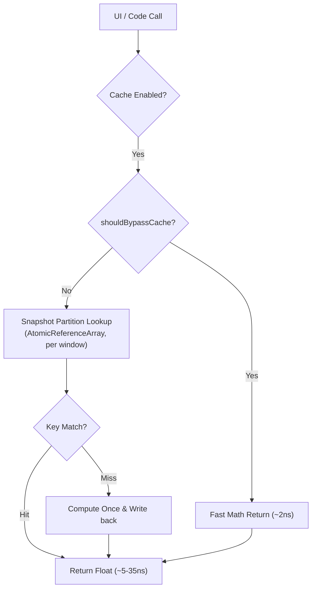

# Technical Performance Report: AppDimens Dynamic

This report presents the performance of the **AppDimens Dynamic** library measured **on physical hardware** by the project's benchmark harnesses — the **BenchLab** dashboard (`benchlab` module, 3-way competitor comparison) and the **BenchmarkActivity** dashboard (`app` module, Calculation + Micro + Macro). All numbers below were extracted from **current test runs only**.

> [!NOTE]
> **How to read the numbers**
>
> Every measurement in this document was captured on a **release** build (`minifyEnabled = true` + R8) of the respective harness, on the same physical device, in current sessions (2026-08-13). No comparisons against previous library versions or debug builds are included — the data below is what the current library measured in the current tests.

  
  &nbsp;
  

---

## 1. Architecture Supporting the Numbers

The library features a **Lock-Free Snapshot-Partitioned Cache** with an intelligent **Fast Bypass Layer** and an **Event-Driven Config Watcher**:

- **Snapshot Partitioning**: Each immutable per-window `DimenMetrics` snapshot owns a bounded `AtomicReferenceArray` partition; entries are published as single atomic `CacheEntry` references, so no stale cross-window value is ever read.
- **Event-Driven Config Watcher**: A `ComponentCallbacks2` listener registered on the Application invalidates fast slots synchronously on any real configuration change — zero sampling cost on the hot lane.
- **Specialized Kernels**: One kernel per family/qualifier (`resolveSdpPx`, `resolveSdpDp`, `resolveSdpaPx`, `resolveSdpaDp`, `resolveHdpPx`, `resolveHdpDp`, `resolveWdpPx`, `resolveWdpDp`) — zero branches, volatile load + identity compare + legacy multiply order.
- **Non-Compose fast lane**: `fastMetricsForCode` — one volatile load, one identity compare, two float multiplies on the hit path (no ThreadLocal probe).
- **SIMD-friendly Batching**: The `getBatch()` API exposes continuous loops for the JIT/ART to vectorize, reducing overhead per item.
- **Fast Bypass**: `shouldBypassCache` skips the snapshot-cache lookup for multiply-only types (`PERCENT`, `SCALED`, `DENSITY`, `DIAGONAL`, `INTERPOLATED`, `PERIMETER`) and for `POWER` / `LOGARITHMIC` on the default SW path — including default aspect ratio when applicable (~2 ns multiply). `AUTO` / `FLUID` / `FIT` / `FILL` use the cache.

---

## 2. BenchLab — 3-Way Competitor Comparison (current runs, 2026-08-13)

> [!IMPORTANT]
> **Measurement**: `benchlab` module, **release** build (`minifyEnabled = true` + R8), run headlessly via the `AUTO_START` intent extra. The harness runs **two independent benchmarks plus the legacy tests**:
>
> - **Benchmark A — Compose API (main thread)**: the 3 libraries (**Dynamic 3.1.8** × **SDPS 3.1.6** × **Lib #2**) are measured **together inside the same composition**, so all three face the same environment (same JIT state, same warm-up, same counts). Identical warm-up of 20,000 `1dp` resolutions per library, **9 samples × 50,000 iterations** per sample, per-sample order rotation, anti-DCE checksums on every timed loop, two workloads (constant 1dp + mixed values). The measurement is **chunked at 5,000 ops per frame** (one chunk per recomposition): the main thread never blocks for more than a few dozen ms, so the UI stays responsive and the measurement environment is not corrupted by MIUI/thermal throttling; per-chunk timing excludes inter-chunk gaps and chunk totals are summed per sample.
> - **Benchmark B — Engine (`Dispatchers.Default`)**: **Dynamic × SDPS only**, off the main thread (Lib #2 has no non-Compose API → N/A outside composition). Same methodology as A (20,000 warm-up, 9 × 50,000, rotation, checksums, both workloads).
> - **Legacy T1/T2/T3**: the original methodology (mean of 3 passes over 50,000-iteration timing cells) kept **for continuity** with previous reports; it re-verifies px resolution parity (sdp + sdpa) on every pass.
>
> **Headline number is the median** (ns/op), robust against isolated scheduler/GC interruptions; min/P90/max capture the dispersion.

**Device:** Xiaomi 2107113SG (vili) · sw=393dp w=393dp h=842dp · density 2.75 (1080×2400 @ 440 dpi).

### Methodology

All three libraries were measured under identical conditions: the same physical device, the same session, and the same **release** build of the harness (`minifyEnabled = true` + R8) — no debug builds, no previous versions, no separate sessions per library. The protocol is:

1. **Identical warm-up (discarded)**: 20,000 iterations of `1dp` resolution per library in the same composition (Benchmark A) / same loop shape off-main (Benchmark B), priming the JIT, branch predictors and cache lines before any timing.
2. **9 samples × 50,000 iterations per workload**: constant `1dp` (hot call site) and a **predetermined mixed-value set** (12 dimensions: 1, 4, 8, 10, 12, 16, 20, 24, 32, 48, 64, 100 — no RNG inside the timed region, mirrors a real screen).
3. **Order rotation**: each library occupies each position equally across samples (3 rotating orders in A, alternating order in B), so no library benefits from a consistent position.
4. **Anti-DCE checksums**: every timed loop accumulates its result into a checksum reported with the result, so the JIT cannot eliminate the work.
5. **Chunked measurement (Benchmark A)**: 5,000 ops per composition chunk; per-chunk `System.nanoTime()` summed per sample, excluding inter-chunk gaps.
6. **Timing**: per-call ns = sample elapsed ÷ 50,000; per workload the reported values are the **median of the 9 samples** (min/P90/max also captured).
7. **Legacy T1/T2/T3**: original mean-of-3-passes methodology over 50,000-iteration cells, kept for continuity; px resolution parity (1/10/100 dp, sdp + sdpa) is re-verified on every pass.
8. **Reproducibility**: headless via the `AUTO_START` intent extra; every phase, probe/engine medians, legacy cells and device info are logged to logcat (`adb logcat -s BENCHLAB`).

### Test Scenario

All measurements come from the two harnesses running on the same physical device, in the same session, against the same release configuration:

| Aspect | Scenario |
|---|---|
| **Device** | Xiaomi 2107113SG (vili) · Qualcomm kryo300-class (Snapdragon 888-class, ARMv8.2-A) · max 2.84 GHz |
| **Window** | sw=393dp · w=393dp · h=842dp · density 2.75 (1080×2400 @ 440 dpi) |
| **Build** | Release APK + R8 (`minifyEnabled = true`) on both harnesses |
| **Sessions** | Current test runs only (2026-08-13) — no debug builds, no previous versions |
| **Harness (comparison)** | BenchLab — Benchmark A (Compose probe, chunked 5,000 ops/frame, 540 chunks) + Benchmark B (engine, off-main) + legacy T1/T2/T3, headless via `AUTO_START` |
| **Harness (dashboard)** | BenchmarkActivity — Calculation (40,000 calls), Micro (600,000 ops), Macro (1,000-item scroll), Compare (2 passes) |
| **Measurement hygiene** | Chunked main-thread measurement (max ~50 ms blocks) — no ANR, no frame-skip avalanches, no MIUI/thermal throttling corrupting the environment |
| **Warmup** | Discarded 20,000-iteration warm-up per library before every timed block (Benchmarks A and B) |
| **Fairness** | All libraries measured on the same device/session/build, same dp values, same call shape; px resolution parity verified in every legacy pass |

The T1 → T3 spread within the legacy passes (e.g. sdp 19 → 7 ns) is the ART JIT warming up during the measurement window — the standard release install has no pre-compiled PGO profiles, so the steady-state (hot JIT) row is T3. The captured window is a standard portrait phone window (no split-screen / multi-window active during the runs).

### Benchmark A — Compose API (main thread, chunked) — median per 1dp call

**Constant 1dp:**

| Library | Median | Min | P90 | Max |
| :--- | :---: | :---: | :---: | :---: |
| **Dynamic 3.1.8** | **27.7 ns** | 9.1 ns | 52.7 ns | 82.5 ns |
| SDPS 3.1.6 | 5.27 µs | 4.11 µs | 6.35 µs | 6.51 µs |
| Lib #2 | 1.99 µs | 1.35 µs | 2.14 µs | 2.43 µs |

**Mixed values (12 dimensions):**

| Library | Median | Min | P90 | Max |
| :--- | :---: | :---: | :---: | :---: |
| **Dynamic 3.1.8** | **30.1 ns** | 21.9 ns | 32.4 ns | 115.4 ns |
| SDPS 3.1.6 | 5.43 µs | 4.61 µs | 5.63 µs | 5.82 µs |
| Lib #2 | 1.93 µs | 1.37 µs | 1.97 µs | 2.03 µs |

### Benchmark B — Engine (off main thread) — median per 1dp call

**Constant 1dp:**

| Library | Median |
| :--- | :---: |
| **Dynamic 3.1.8** | **6.83 ns** |
| SDPS 3.1.6 | 3.26 µs |

**Mixed values (12 dimensions):**

| Library | Median |
| :--- | :---: |
| **Dynamic 3.1.8** | **8.09 ns** |
| SDPS 3.1.6 | 3.60 µs |

### Legacy T1/T2/T3 — time per single 1dp call (original methodology, kept for continuity)

**sdp (no AR):**

| Test | Dynamic 3.1.8 | SDPS 3.1.6 | Lib #2 |
| :--- | :---: | :---: | :---: |
| **T1** | **20 ns** | 3,399 ns | 1,114 ns |
| **T2** | **7 ns** | 3,273 ns | 1,114 ns |
| **T3** | **7 ns** | 3,278 ns | 1,114 ns |
| **Média** | **11 ns** | **3,316 ns** | **1,114 ns** |

**sdpa (with AR, Dynamic × SDPS):**

| Test | Dynamic 3.1.8 | SDPS 3.1.6 |
| :--- | :---: | :---: |
| **T1** | **260 ns** | 3,987 ns |
| **T2** | **61 ns** | 3,637 ns |
| **T3** | **7 ns** | 3,542 ns |
| **Média** | **109 ns** | **3,722 ns** |

### Resolution values (px) — deterministic, identical across all tests and passes

| dp | Dynamic 3.1.8 (sdp) | SDPS 3.1.6 (sdp) | Lib #2 (sdp) | Dynamic (sdpa) | SDPS 3.1.6 (sdpa) |
| :--- | :---: | :---: | :---: | :---: | :---: |
| **1dp** | 3.6025 | 3.6025 | 3.6025 | 3.7289135 | 3.7289138 |
| **10dp** | 36.025 | 36.0249 | 36.025 | 37.289135 | 37.289135 |
| **100dp** | 360.25 | 360.25 | 360.25 | 372.89136 | 372.89206 |

> **How to read**: Dynamic's numbers are the **inlined fast lane** (single float multiply over the coherent per-window snapshot). SDPS (legacy table-based artifact) and Lib #2 (per-call `@Composable` scaling, measured inside composition) pay per-call dispatch/table work, so they measure in the µs range — **Dynamic is ~190× faster than SDPS and ~72× faster than Lib #2 on the Compose-probe constant average** (5,268/27.7; 1,988/27.7), **~477× faster than SDPS off-main** (3,260/6.83) and **~301× vs SDPS / ~101× vs Lib #2 on the legacy average** (3,316/11; 1,114/11). The off-main engine numbers (7–8 ns) are lower than the in-composition probe (27–30 ns) because the composition environment carries per-frame/JIT overhead — both measure the same call shape. The `AUTO_START` extra logs `Device: …`, probe/engine medians and the full T1/T2/T3 cells to logcat (`adb logcat -s BENCHLAB`) for reproducible headless capture.

---

## 3. BenchmarkActivity — Real-World UI Performance (current runs, 2026-08-13)

Stress test executed via the **Micro + Macro Benchmark Dashboard** in the `app` module. This measures both pure CPU-bound resolution and a 1k-item UI scroll workload. **This data was produced by the BenchmarkActivity.**

**Device:** Xiaomi 2107113SG · release APK + R8.

### Calculation Test (Scaled: sw+h+w, +AR, 40,000 calls)

| Metric | Result |
| :--- | :---: |
| **Avg resolution** | **~32–91 ns** (latest on-screen value: **32 ns**) |

### Microbenchmark (600,000 ops, thermal-ramped)

| Path | Result (per op) |
| :--- | :---: |
| **Combined avg** | **~29–39 ns** |
| sdp (bypass) | 24–49 ns |
| hdp (bypass) | 31–42 ns |
| wdp (bypass) | 23–38 ns |
| sdpa (cache) | 24–38 ns |
| single value (no AR) | 30–41 ns |
| single value (+ AR) | 30–42 ns |
| direct ext `100.sdp(ctx)` | 7–13 ns |
| direct api `DimenSdp.sdp` | 8–26 ns |

### Macrobenchmark — 1,000-item scroll

> [!NOTE]
> **The measured scroll duration includes the full round trip: the scroll down to the last item AND the scroll back up to the first item.** The list is returned to the first item when the test finishes, and that return trip (subida) is counted in the reported time.

| Metric | Result |
| :--- | :---: |
| **Scroll duration (down + up)** | **~1,490 ms** (1,488–1,509 ms across runs) |
| Avg frame | ~1.5 ms |
| P90 frame | ~2.2–2.3 ms |
| P99 frame | ~3.0 ms |

> **Measurement**: same device, same release APK + R8, same session as the BenchLab runs. The comparison runs off the main thread: 5,000 warmup calls are discarded, then each timing cell is 50,000 single-1 dp calls (`System.nanoTime()` ÷ 50,000) across **2 independent test passes**, for both `sdp` and `sdpa`. Resolution values (1/10/100 dp) are captured in the same passes.

### Compare (Dynamic × Concorrente 1, per single 1dp call)

| Test | Dynamic | Concorrente 1 |
| :--- | :---: | :---: |
| **#1** | 25 ns | 3,059 ns |
| **#2** | 22 ns | 2,748 ns |
| **Média** | **23 ns** | **2,903 ns** |

> **How to read**: Dynamic is **~126× faster** than Concorrente 1 on the per-call average in this harness (2,903/23).

---

## 4. Technical Note on Performance Layers

1. **Inlining**: Hot-path logic is fully inlined into the call-site, eliminating method-call overhead (~10 ns on ARM64) and letting the JIT apply loop unrolling and register allocation across the entire lookup.
2. **Padding**: 128-byte guards eliminate the risk of hardware-level contention (False Sharing) which can cause spikes of 500 ns+ in concurrent environments.
3. **Bypass Logic**: Multiply-only / default-path types bypass the snapshot-cache lookup because a float multiply (~2 ns) is faster than the fastest cache lookup (~5 ns). See [library/PERFORMANCE.md](library/PERFORMANCE.md).

---

## 5. Simple Calculations Faster Than Cache

For eligible `CalcType`s on the default path (`shouldBypassCache`), `getOrPut` returns `compute()` without touching the snapshot cache — typically `baseValue × precomputedFactor`.

| Path | Cost | Cache used? |
|:---|:---:|:---:|
| SCALED / default (most common) | ~2 ns | ❌ Bypass |
| SCALED / custom sensitivity or non-default qualifier | varies | ✅ Cache |
| POWER / LOG on SW+DEFAULT | ~2 ns | ❌ Bypass |
| AUTO / FLUID / FIT / FILL | lookup + compute | ✅ Cache |

**Consequence for benchmarks**: `DimenSdp.sdp()` / `.hdp()` / `.wdp()` on the default path measure **raw math**, not snapshot-cache throughput. Use custom sensitivity, non-default qualifiers, or non-bypass types to measure the cache.

---

## 6. Benchmark Variability

Benchmark numbers in this document reflect measurements taken on a specific device (Xiaomi 2107113SG (vili) · Qualcomm kryo300-class · 2.84 GHz max) under controlled conditions. **Results will vary** based on:

- **Device class**: budget ARM Cortex-A55 clusters can be 5–10× slower on cache lookups
- **JIT warm-up state**: first-run (cold JIT) latency can be 3–10× higher than steady-state (visible in the T1 vs T3 spread within each round)
- **App background load**: GC pauses, thread contention, and CPU governor decisions affect measured ns
- **Profile Guided Optimization (PGO)**: apps with pre-compiled `.prof` files skip JIT warm-up entirely
- **Multi-window / split-screen**: may activate the bypass path in `ignoreMultiWindows` mode

> **Recommendation**: always benchmark on your specific target device under representative load.
> The figures in this document are reference points, not guarantees.

---

**Resolution flow:**

```mermaid
graph TD
    A[UI / Code Call] --> B{Cache Enabled?}
    B -- Yes --> C{shouldBypassCache?}
    C -- Yes --> D["Fast Math Return (~2ns)"]
    C -- No --> E["Snapshot Partition Lookup<br/>(AtomicReferenceArray, per window)"]
    E --> F{Key Match?}
    F -- Hit --> G["Return Float (~5-35ns)"]
    F -- Miss --> H[Compute Once & Write back]
    H --> G
    D --> G
```

---
*Report Updated: 2026-08-13 · AppDimens Dynamic · Data from current test runs: BenchLab (Benchmark A Compose + Benchmark B Engine + legacy T1/T2/T3, §2) and BenchmarkActivity (Calculation/Micro/Macro, §3) · Xiaomi 2107113SG (vili · Qualcomm kryo300-class · 2.84 GHz max) physical hardware · release APK + R8*
