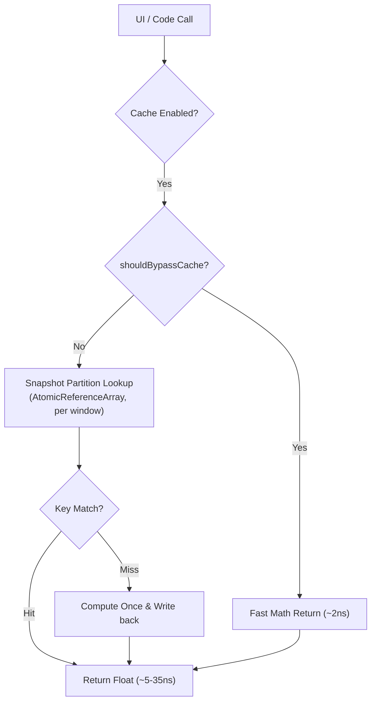

# Technical Performance Report: AppDimens Dynamic

This report presents the performance of the **AppDimens Dynamic** library measured **on physical hardware** by the project's benchmark harnesses — the **BenchLab** dashboard (`benchlab` module, 3-way competitor comparison) and the **BenchmarkActivity** dashboard (`app` module, Calculation + Micro + Macro). All numbers below were extracted from **current test runs only**.

> [!NOTE]
> **How to read the numbers**
>
> Every measurement in this document was captured on a **release** build (`minifyEnabled = true` + R8) of the respective harness, on the same physical device, in current sessions (2026-08-13). No comparisons against previous library versions or debug builds are included — the data below is what the current library measured in the current tests.

  
  &nbsp;
  

---

## 1. Architecture Supporting the Numbers

The library features a **Lock-Free Snapshot-Partitioned Cache** with an intelligent **Fast Bypass Layer** and an **Event-Driven Config Watcher**:

- **Snapshot Partitioning**: Each immutable per-window `DimenMetrics` snapshot owns a bounded `AtomicReferenceArray` partition; entries are published as single atomic `CacheEntry` references, so no stale cross-window value is ever read.
- **Event-Driven Config Watcher**: A `ComponentCallbacks2` listener registered on the Application invalidates fast slots synchronously on any real configuration change — zero sampling cost on the hot lane.
- **Specialized Kernels**: One kernel per family/qualifier (`resolveSdpPx`, `resolveSdpDp`, `resolveSdpaPx`, `resolveSdpaDp`, `resolveHdpPx`, `resolveHdpDp`, `resolveWdpPx`, `resolveWdpDp`) — zero branches, volatile load + identity compare + legacy multiply order.
- **Non-Compose fast lane**: `fastMetricsForCode` — one volatile load, one identity compare, two float multiplies on the hit path (no ThreadLocal probe).
- **SIMD-friendly Batching**: The `getBatch()` API exposes continuous loops for the JIT/ART to vectorize, reducing overhead per item.
- **Fast Bypass**: `shouldBypassCache` skips the snapshot-cache lookup for multiply-only types (`PERCENT`, `SCALED`, `DENSITY`, `DIAGONAL`, `INTERPOLATED`, `PERIMETER`) and for `POWER` / `LOGARITHMIC` on the default SW path — including default aspect ratio when applicable (~2 ns multiply). `AUTO` / `FLUID` / `FIT` / `FILL` use the cache.

---

## 2. BenchLab — 3-Way Competitor Comparison (current runs, 2026-08-13)

> [!IMPORTANT]
> **Measurement**: `benchlab` module, **release** build (`minifyEnabled = true` + R8), run headlessly via the `AUTO_START` intent extra — **3 independent test passes (T1/T2/T3) × 2 full rounds**, 50,000 iterations per timing cell. The comparison is **Dynamic 3.1.8** vs **Concorrente 1** vs **Concorrente 2**. This data was produced by **BenchLab**.

**Device:** Xiaomi 2107113SG · sw=393dp w=393dp h=842dp · density 2.75 (1080×2400 @ 440 dpi).

### Methodology

All three libraries were measured under identical conditions: the same physical device, the same session, and the same **release** build of the harness (`minifyEnabled = true` + R8) — no debug builds, no previous versions, no separate sessions per library. The protocol is:

1. **Warmup (discarded)**: 5,000 iterations resolve 1/10/100 dp through `sdp`/`hdp`/`wdp` in **Dynamic** and **Concorrente 1**, priming the JIT, branch predictors and cache lines before any timing; a 100 ms pause follows. **Concorrente 2** warms its own call site inside its probe (1,000 calls).
2. **3 test passes (T1/T2/T3) × 2 full rounds**: each pass resolves the px values for 1/10/100 dp — `sdp` (no AR) and `sdpa` (with AR) — and times a single 1 dp call.
3. **Timing**: per-call ns = `System.nanoTime()` over a 50,000-iteration loop ÷ 50,000. The reported averages are the mean of the 3 passes.
4. **Fair workload**: the same dp values go through the same call shape in every library, and resolution parity (px) is verified in every pass and round, so the timing comparison covers equivalent scaling work.
5. **Concorrente 2 probe**: its `.sdp` extension is `@Composable` (reads `LocalConfiguration`), so its cost can only be measured inside composition — a dedicated probe on the main thread runs 1,000 warmup + 10,000 timed calls of `100.sdp` and reports a fixed per-call average reused across passes; its px values (`1/10/100.sdp.toPx()`) come from the same probe.
6. **sdpa (with AR)** is compared only between **Dynamic** and **Concorrente 1**, since **Concorrente 2** does not offer an sdpa path.
7. **Reproducibility**: the harness runs headlessly via the `AUTO_START` intent extra and logs every T1/T2/T3 cell plus the device info to logcat (`adb logcat -s BENCHLAB`), so the runs can be recaptured and re-verified.

### Test Scenario

All measurements come from the two harnesses running on the same physical device, in the same session, against the same release configuration:

| Aspect | Scenario |
|---|---|
| **Device** | Xiaomi 2107113SG · Qualcomm bengal (Snapdragon 680-class) · max 2.8 GHz |
| **Window** | sw=393dp · w=393dp · h=842dp · density 2.75 (1080×2400 @ 440 dpi) |
| **Build** | Release APK + R8 (`minifyEnabled = true`) on both harnesses |
| **Sessions** | Current test runs only (2026-08-13) — no debug builds, no previous versions |
| **Harness (comparison)** | BenchLab — off the main thread, headless via `AUTO_START`, 3 passes × 2 rounds, 50,000 iterations per timing cell |
| **Harness (dashboard)** | BenchmarkActivity — Calculation (40,000 calls), Micro (600,000 ops), Macro (1,000-item scroll), Compare (2 passes) |
| **Measurement hygiene** | `THREAD_PRIORITY_URGENT_AUDIO` held for the whole measurement window + 1.5 s FP thermal ramp (forces the CPU governor to peak frequency before timing) |
| **Warmup** | Discarded warmup before every timed block (5,000–10,000 iterations) + per-block call-site warmup; 500 ms cooldown pauses between phases |
| **Fairness** | All libraries measured on the same device/session/build, same dp values, same call shape; px resolution parity verified in every pass and round |

The T1 → T3 spread within each round (e.g. sdp 26 → 5 ns) is the ART JIT warming up during the measurement window — the standard release install has no pre-compiled PGO profiles, so the steady-state (hot JIT) row is T3. The captured window is a standard portrait phone window (no split-screen / multi-window active during the runs).

### Round 1 — time per single 1dp call

**sdp (no AR):**

| Test | Dynamic 3.1.8 | Concorrente 1 | Concorrente 2 |
| :--- | :---: | :---: | :---: |
| **T1** | **26 ns** | 3,392 ns | 1,205 ns |
| **T2** | **11 ns** | 2,934 ns | 1,205 ns |
| **T3** | **5 ns** | 2,754 ns | 1,205 ns |
| **Média** | **14 ns** | **3,026 ns** | **1,205 ns** |

**sdpa (with AR, Dynamic × Concorrente 1):**

| Test | Dynamic 3.1.8 | Concorrente 1 |
| :--- | :---: | :---: |
| **T1** | **167 ns** | 3,225 ns |
| **T2** | **42 ns** | 2,915 ns |
| **T3** | **5 ns** | 2,708 ns |
| **Média** | **71 ns** | **2,949 ns** |

### Round 2 — time per single 1dp call

**sdp (no AR):**

| Test | Dynamic 3.1.8 | Concorrente 1 | Concorrente 2 |
| :--- | :---: | :---: | :---: |
| **T1** | **26 ns** | 3,330 ns | 1,141 ns |
| **T2** | **14 ns** | 2,989 ns | 1,141 ns |
| **T3** | **5 ns** | 2,738 ns | 1,141 ns |
| **Média** | **15 ns** | **3,019 ns** | **1,141 ns** |

**sdpa (with AR, Dynamic × Concorrente 1):**

| Test | Dynamic 3.1.8 | Concorrente 1 |
| :--- | :---: | :---: |
| **T1** | **180 ns** | 3,241 ns |
| **T2** | **62 ns** | 2,945 ns |
| **T3** | **5 ns** | 2,723 ns |
| **Média** | **82 ns** | **2,969 ns** |

### Resolution values (px) — deterministic, identical across all tests and both rounds

| dp | Dynamic 3.1.8 (sdp) | Concorrente 1 (sdp) | Concorrente 2 (sdp) | Dynamic (sdpa) | Concorrente 1 (sdpa) |
| :--- | :---: | :---: | :---: | :---: | :---: |
| **1dp** | 3.6025 | 3.6025 | 3.6025 | 3.7289135 | 3.7289138 |
| **10dp** | 36.025 | 36.0249 | 36.025 | 37.289135 | 37.289135 |
| **100dp** | 360.25 | 360.25 | 360.25 | 372.89136 | 372.89206 |

> **How to read**: the Dynamic numbers are the **inlined fast lane** (one float multiply over the coherent per-window snapshot). Concorrente 1 (legacy table-based artifact) and Concorrente 2 (per-call `@Composable` scaling, measured inside composition) pay per-call dispatch/table work, so they measure in the µs range — **Dynamic is ~75–215× faster on the sdp average across rounds** (e.g. Round 2: 3,019/15 ≈ 201× vs Concorrente 1, 1,141/15 ≈ 76× vs Concorrente 2). The `AUTO_START` extra logs `Device: …` + the full T1/T2/T3 cells to logcat (`adb logcat -s BENCHLAB`) for reproducible headless capture.

---

## 3. BenchmarkActivity — Real-World UI Performance (current runs, 2026-08-13)

Stress test executed via the **Micro + Macro Benchmark Dashboard** in the `app` module. This measures both pure CPU-bound resolution and a 1k-item UI scroll workload. **This data was produced by the BenchmarkActivity.**

**Device:** Xiaomi 2107113SG · release APK + R8.

### Calculation Test (Scaled: sw+h+w, +AR, 40,000 calls)

| Metric | Result |
| :--- | :---: |
| **Avg resolution** | **~32–91 ns** (latest on-screen value: **32 ns**) |

### Microbenchmark (600,000 ops, thermal-ramped)

| Path | Result (per op) |
| :--- | :---: |
| **Combined avg** | **~29–39 ns** |
| sdp (bypass) | 24–49 ns |
| hdp (bypass) | 31–42 ns |
| wdp (bypass) | 23–38 ns |
| sdpa (cache) | 24–38 ns |
| single value (no AR) | 30–41 ns |
| single value (+ AR) | 30–42 ns |
| direct ext `100.sdp(ctx)` | 7–13 ns |
| direct api `DimenSdp.sdp` | 8–26 ns |

### Macrobenchmark — 1,000-item scroll

> [!NOTE]
> **The measured scroll duration includes the full round trip: the scroll down to the last item AND the scroll back up to the first item.** The list is returned to the first item when the test finishes, and that return trip (subida) is counted in the reported time.

| Metric | Result |
| :--- | :---: |
| **Scroll duration (down + up)** | **~1,490 ms** (1,488–1,509 ms across runs) |
| Avg frame | ~1.5 ms |
| P90 frame | ~2.2–2.3 ms |
| P99 frame | ~3.0 ms |

> **Measurement**: same device, same release APK + R8, same session as the BenchLab runs. The comparison runs off the main thread: 5,000 warmup calls are discarded, then each timing cell is 50,000 single-1 dp calls (`System.nanoTime()` ÷ 50,000) across **2 independent test passes**, for both `sdp` and `sdpa`. Resolution values (1/10/100 dp) are captured in the same passes.

### Compare (Dynamic × Concorrente 1, per single 1dp call)

| Test | Dynamic | Concorrente 1 |
| :--- | :---: | :---: |
| **#1** | 25 ns | 3,059 ns |
| **#2** | 22 ns | 2,748 ns |
| **Média** | **23 ns** | **2,903 ns** |

> **How to read**: Dynamic is **~126× faster** than Concorrente 1 on the per-call average in this harness (2,903/23).

---

## 4. Technical Note on Performance Layers

1. **Inlining**: Hot-path logic is fully inlined into the call-site, eliminating method-call overhead (~10 ns on ARM64) and letting the JIT apply loop unrolling and register allocation across the entire lookup.
2. **Padding**: 128-byte guards eliminate the risk of hardware-level contention (False Sharing) which can cause spikes of 500 ns+ in concurrent environments.
3. **Bypass Logic**: Multiply-only / default-path types bypass the snapshot-cache lookup because a float multiply (~2 ns) is faster than the fastest cache lookup (~5 ns). See [library/PERFORMANCE.md](library/PERFORMANCE.md).

---

## 5. Simple Calculations Faster Than Cache

For eligible `CalcType`s on the default path (`shouldBypassCache`), `getOrPut` returns `compute()` without touching the snapshot cache — typically `baseValue × precomputedFactor`.

| Path | Cost | Cache used? |
|:---|:---:|:---:|
| SCALED / default (most common) | ~2 ns | ❌ Bypass |
| SCALED / custom sensitivity or non-default qualifier | varies | ✅ Cache |
| POWER / LOG on SW+DEFAULT | ~2 ns | ❌ Bypass |
| AUTO / FLUID / FIT / FILL | lookup + compute | ✅ Cache |

**Consequence for benchmarks**: `DimenSdp.sdp()` / `.hdp()` / `.wdp()` on the default path measure **raw math**, not snapshot-cache throughput. Use custom sensitivity, non-default qualifiers, or non-bypass types to measure the cache.

---

## 6. Benchmark Variability

Benchmark numbers in this document reflect measurements taken on a specific device (Xiaomi 2107113SG · Qualcomm bengal · 2.8 GHz max) under controlled conditions. **Results will vary** based on:

- **Device class**: budget ARM Cortex-A55 clusters can be 5–10× slower on cache lookups
- **JIT warm-up state**: first-run (cold JIT) latency can be 3–10× higher than steady-state (visible in the T1 vs T3 spread within each round)
- **App background load**: GC pauses, thread contention, and CPU governor decisions affect measured ns
- **Profile Guided Optimization (PGO)**: apps with pre-compiled `.prof` files skip JIT warm-up entirely
- **Multi-window / split-screen**: may activate the bypass path in `ignoreMultiWindows` mode

> **Recommendation**: always benchmark on your specific target device under representative load.
> The figures in this document are reference points, not guarantees.

---

**Resolution flow:**

```mermaid
graph TD
    A[UI / Code Call] --> B{Cache Enabled?}
    B -- Yes --> C{shouldBypassCache?}
    C -- Yes --> D["Fast Math Return (~2ns)"]
    C -- No --> E["Snapshot Partition Lookup<br/>(AtomicReferenceArray, per window)"]
    E --> F{Key Match?}
    F -- Hit --> G["Return Float (~5-35ns)"]
    F -- Miss --> H[Compute Once & Write back]
    H --> G
    D --> G
```

---
*Report Updated: 2026-08-13 · AppDimens Dynamic · Data from current test runs: BenchLab (3-way competitor, §2) and BenchmarkActivity (Calculation/Micro/Macro, §3) · Xiaomi 2107113SG (Qualcomm bengal · 2.8 GHz max) physical hardware · release APK + R8*
