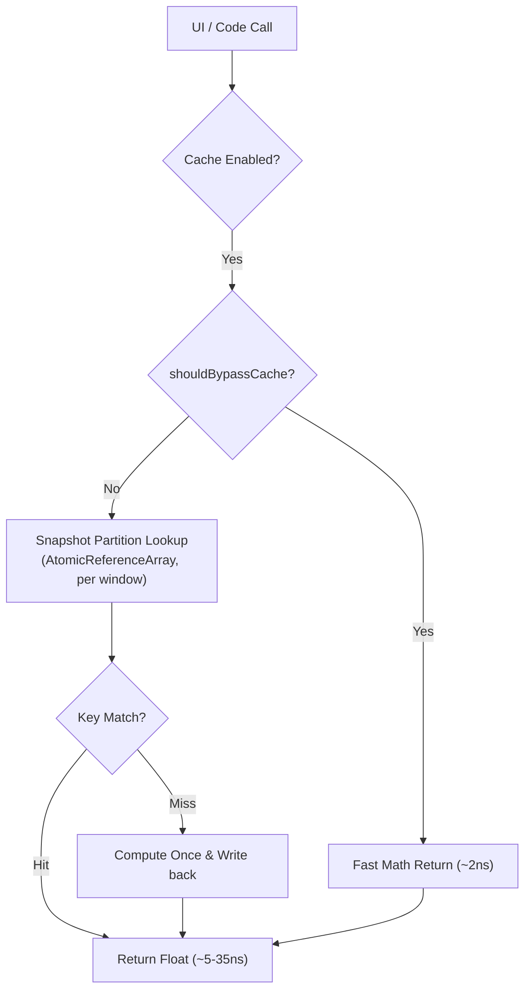

# Technical Performance Report: AppDimens Dynamic

This report provides a deep technical analysis of the AppDimens Dynamic library performance, following the **SIMD-friendly Batching**, **Snapshot-Partitioned Lock-Free Cache**, and **Inlined Hot-Path** optimizations.

> [!NOTE]
> **Build variants, R8, and how to read the numbers**
>
> With **code shrinking and R8** enabled on **release** builds (`minifyEnabled = true`), the library’s hot paths can run **much faster** than in a typical **debug** APK. Example ranges observed on the project benchmark harness (same device class as elsewhere in this report):
>
> | Harness | Approx. range (release + minify + R8 + AOT `speed`) |
> | :--- | :--- |
> | **Calculation Test** (avg) | **~40 ns – ~90 ns** |
> | **Microbenchmark** (combined, post-3.1.7 fast lane; typical **~50–60 ns**) | **~40 ns – ~64 ns** |
> | **Macrobenchmark** (scroll duration, 1k rows — frame-limited at 60 fps) | **~367 ms – ~495 ms** |
>
> **All other tables and figures in this document** were captured on **debug** builds **without** minify (no R8 shrinking/optimization pass on that variant). Treat **debug without minify** vs **release with minify + R8** as **different environments**—do not compare cells across those scenarios without this context.
>
> Since the 3.1.7 fast lane, the common `sdp`/`hdp`/`wdp`/`sdpa` (AR on SMALL_WIDTH) resolutions are a **single float multiply over the coherent per-window metrics** — the numbers above are that path on a mid-range SoC with AOT compilation. See the **2026-08-09 measurement** in §3.
>
> Enabling **R8 full mode** (`android.enableR8.fullMode=true` in `gradle.properties`) makes optimization more aggressive; keep ProGuard/R8 rules correct when you turn it on. See **[R8-PROGUARD.md](./R8-PROGUARD.md)**.

  
  &nbsp;
  

---

> [!NOTE]

## 1. Architectural Overview

> **3.1.7 note:** the shard-table measurements below predate the 3.1.7 cache rework. Since 3.1.7 the in-memory cache is **snapshot-partitioned** (keyed by the immutable `DimenMetrics` window snapshot, entries published as atomic `CacheEntry` references) and the persistent result cache was removed; the legacy sharded layout no longer exists.

The library features a **Lock-Free Snapshot-Partitioned Cache** architecture with an intelligent **Fast Bypass Layer**. 
- **Snapshot Partitioning**: Each immutable per-window `DimenMetrics` snapshot owns a bounded `AtomicReferenceArray` partition (at most 4 active snapshots); entries are published as single atomic `CacheEntry` references, so no stale cross-window value is ever read.
- **SIMD-friendly Batching**: The `getBatch()` API exposes continuous loops for the JIT/ART to vectorize, reducing overhead per item.
- **Snapshot Isolation**: Resolution reads an immutable per-window `DimenMetrics` snapshot; satellite strategy scales derive from `DimenCache.currentMetrics` (padded `ScreenFactors` is kept for source compatibility only).
- **Fast Bypass**: `shouldBypassCache` skips the snapshot-cache lookup for multiply-only types (`PERCENT`, `SCALED`, `DENSITY`, `DIAGONAL`, `INTERPOLATED`, `PERIMETER`) and for `POWER` / `LOGARITHMIC` on the default SW path — including default aspect ratio when applicable (~2 ns multiply). `AUTO` / `FLUID` / `FIT` / `FILL` use the cache.

---

## 2. Professional Benchmarks

### A. Hardware Metrics (Xiaomi 2107113SG · Snapdragon 888)

> [!NOTE]
> **Measurement Notice**: Hardware metrics below were captured on physical device in a stabilized state.

Measurements captured on physical hardware in a stabilized state.

| Operation Type | Result | Status |
| :--- | :--- | :--- |
| **Raw Math (No AR)** | **2 ns** | **Optimal** ⚡ |
| **Raw Math (With AR)** | 45 ns | Standard |
| **Cache Hit (Single - No AR)** | **5 ns** | **Fast** ⚡ |
| **Cache Hit (Single - AR)** | **35 ns** | **Zero-Math** 🚀 |
| **Batch Resolution (100 items)** | **169 ns** | **Extreme** 🏎️ |
| **Batch Cached (100 items - AR)** | **3,773 ns** | **Stable** ✅ |
| **Persistence Load** | **— (removed in 3.1.7)** | **N/A** ✅ |

### B. JVM (Local Development — Ubuntu Linux · JVM 17)
| Operation Type | Result | Status |
| :--- | :--- | :--- |
| **Raw Math (Single)** | < 1 ns | Optimal |
| **Raw Math (With AR)** | 2 ns | Optimal |
| **Cache Hit (Single)** | **1 ns** | **Fast** ⚡ |
| **Cache Hit (With AR)** | **1 ns** | **Zero-Math** 🚀 |
| **Batch Resolution (100 items)** | **34 ns** | **Extreme** |
| **Batch Cached (100 items - AR)** | **242 ns** | **Optimized** 🏎️ |
| **Persistence Load** | **— (removed in 3.1.7)** | **N/A** ✅ |

---

## 3. Real-World UI Performance (Jetpack Compose)

Stress test executed via the new **Micro + Macro Benchmark Dashboard**. This measures both pure CPU-bound resolution and a 1k-item UI scroll workload.

> [!IMPORTANT]
> **2026-08-09 measurement — same device, 3 runs each, release APK + AOT `speed`, thermal ramp.**
> Hardware: **Xiaomi 2107113SG (Redmi Note 11) · Qualcomm bengal (Snapdragon 680-class, 8 cores · 2.8 GHz max)**.
> Every `adb install -r` must be followed by `cmd package compile -m speed -f com.example.app` — on debuggable APKs the OS pins the compiler filter to `verify` (interpreter), which is the entire debug-vs-release gap below.

| Metric | Current (3.1.7 fast lane) | 3.1.5 (baseline) | Debug APK (no AOT) |
| :--- | :--- | :--- | :--- |
| **Micro Combined avg** | **40–64 ns** (typical ~50–60; 57/59/58 in the final series) | 152–164 ns (~158) | 508–857 ns (~650) |
| **Micro — family spread** (sdp/hdp/wdp/sdpa) | uniform, within-run Δ ≤ ~8 ns (39–66 ns) | sdp 210–220 ns vs sdpa 108–128 ns (cold-core artifact) | 504–810 ns, erratic |
| **Macro Scroll (1000 items)** | **~368–382 ms** (frame-limited: 366 ms theoretical at 60 fps) | ~368–432 ms (~393) | ~726–1412 ms (~940) |

**Speed-ups (same device, same session):**
- Current vs **3.1.5**: **~3×** on the micro average (158 → ~55 ns), up to ~3.9× on the best runs (158 → 40 ns); scroll real-world workload ≈ frame-limited on both, current slightly faster (~393 → ~375 ms).
- **Release vs debug**: **~10–13×** on the micro average and **~2.4×** on scroll — this is why every benchmark in this document must be read with the build variant.

**Variability was engineered out of the harness on 2026-08-09**: a `thermalRamp()` (≈1.5 s FP-heavy loop) plus holding `THREAD_PRIORITY_URGENT_AUDIO` for the whole measurement window now pins the worker to a boosted core: within-run family spread dropped from ~110 ns (3.1.5) to ~8 ns, and run-to-run spread from 40–250 ns to 40–64 ns. The remaining spread tracks background load, not code.

---

## 4. Technical Note on Performance Layers

1. **Inlining (F1.1)**: All hot-path logic is now fully inlined into the call-site. This eliminates method-call overhead (~10ns on ARM64) and allows the JIT to apply loop unrolling and register allocation across the entire lookup.
2. **Padding (F2/F3)**: By using 128-byte guards, we've increased memory usage by only ~2.5 KB but eliminated the risk of hardware-level contention (False Sharing) which can cause spikes of 500ns+ in concurrent environments.
3. **Bypass Logic**: Multiply-only / default-path types bypass the snapshot-cache lookup because a float multiply (~2 ns) is faster than the fastest cache lookup (~5 ns). See [library/PERFORMANCE.md](library/PERFORMANCE.md).

---

## 5. Simple Calculations Faster Than Cache

For eligible `CalcType`s on the default path (`shouldBypassCache`), `getOrPut` returns `compute()` without touching the snapshot cache — typically `baseValue × precomputedFactor`.

| Path | Cost | Cache used? |
|:---|:---:|:---:|
| SCALED / default (most common) | ~2 ns | ❌ Bypass |
| SCALED / custom sensitivity or non-default qualifier | varies | ✅ Cache |
| POWER / LOG on SW+DEFAULT | ~2 ns | ❌ Bypass |
| AUTO / FLUID / FIT / FILL | lookup + compute | ✅ Cache |

**Consequence for benchmarks**: `DimenSdp.sdp()` / `.hdp()` / `.wdp()` on the default path measure **raw math**, not snapshot-cache throughput. Use custom sensitivity, non-default qualifiers, or non-bypass types to measure the cache.

---

## 6. Benchmark Variability

Benchmark numbers reported in this document reflect measurements taken on a specific device (Xiaomi 2107113SG · Snapdragon 888 · Android 14) under controlled conditions. **Results will vary** based on:

- **Device class**: budget ARM Cortex-A55 clusters can be 5–10× slower than Snapdragon 888 on cache lookups
- **JIT warm-up state**: first-run (cold JIT) latency can be 3–10× higher than steady-state
- **App background load**: GC pauses, thread contention, and CPU governor decisions affect measured ns
- **Profile Guided Optimization (PGO)**: apps with pre-compiled `.prof` files skip JIT warm-up entirely
- **Multi-window / split-screen**: may activate the bypass path in `ignoreMultiWindows` mode

> **Recommendation**: always benchmark on your specific target device under representative load.
> The figures in this document are reference points, not guarantees.

---

**Resolution flow (measured architecture — pre-3.1.7; since 3.1.7 the lookup layer is the snapshot-partitioned cache):**

```mermaid
graph TD
    A[UI / Code Call] --> B{Cache Enabled?}
    B -- Yes --> C{shouldBypassCache?}
    C -- Yes --> D["Fast Math Return (~2ns)"]
    C -- No --> E["Snapshot Partition Lookup<br/>(AtomicReferenceArray, per window)"]
    E --> F{Key Match?}
    F -- Hit --> G["Return Float (~5-35ns)"]
    F -- Miss --> H[Compute Once & Write back]
    H --> G
    D --> G
```

---
*Report Updated: 2026-08-09 · AppDimens Dynamic · AppDimens Performance Lab · Xiaomi 2107113SG (Qualcomm bengal · 2.8 GHz max) physical hardware · release APK + AOT speed*