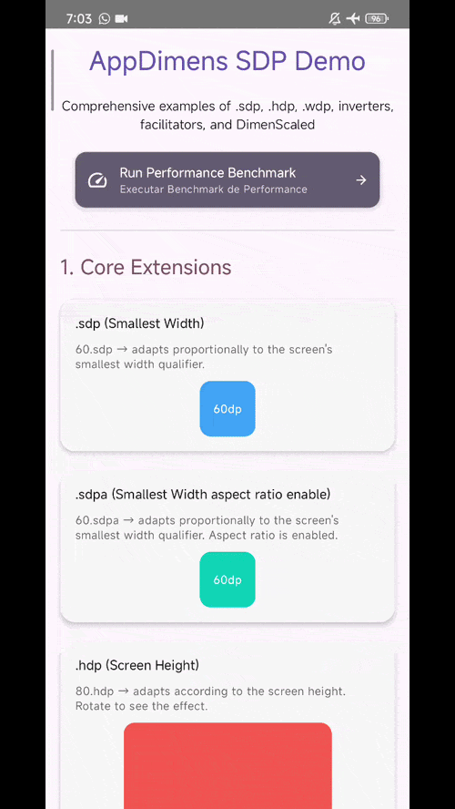
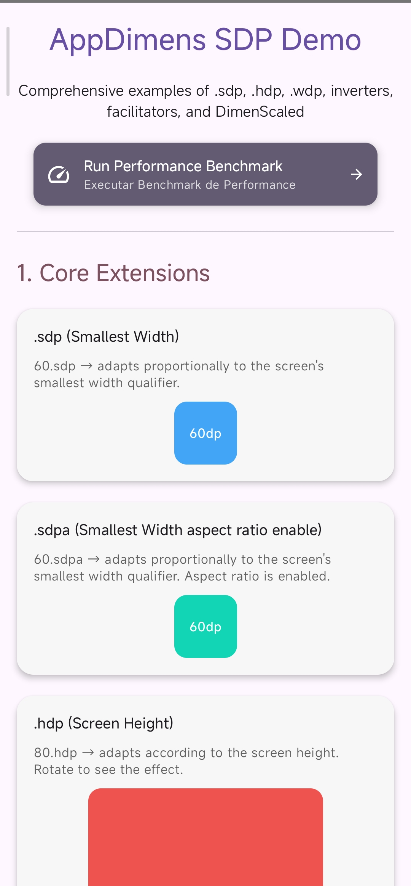
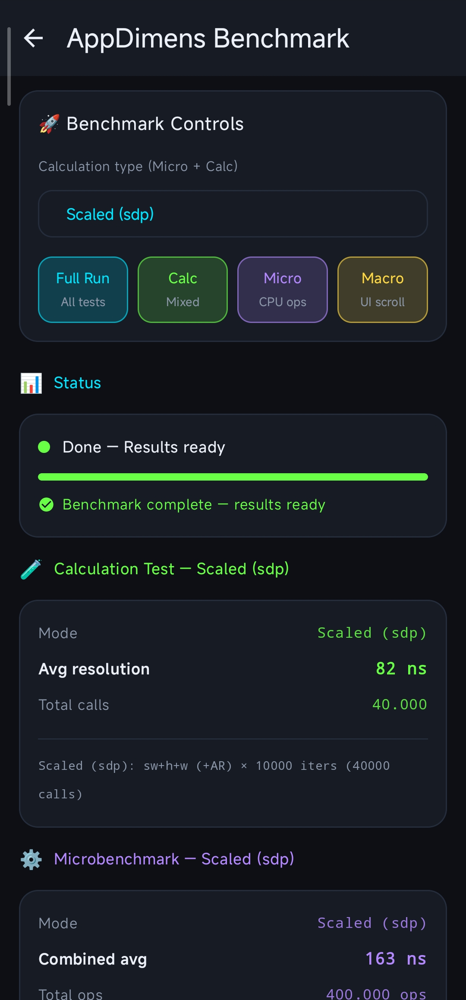

# AppDimens Dynamic (SDP, HDP, WDP)

<p align="center">
  <a href="./DOCUMENTATION/README.md" title="Strategies, formulas, and when to use each scaling mode">
    
  </a>
  &nbsp;&nbsp;
  <a href="./DOCUMENTATION/index.md" title="API documentation in the repo — Markdown package index (KDoc export)">
    
  </a>
  &nbsp;&nbsp;
  <a href="https://appdimens3.web.app/" title="Hosted Dokka site — searchable API reference">
    
  </a>
</p>

---


**AppDimens Dynamic** is the most complete responsive dimension library for Android. It provides a purely dynamic, code-level scaling system — including Jetpack Compose extensions, code-level APIs, conditional builders, orientation-aware inverters, and physical unit converters — all in a single, zero-configuration dependency.

> **Calculation cheat sheet:** scaled · percent (`p*`) · percent (`space*`) · power · fluid · auto · diagonal · fill · fit · interpolated · logarithmic · perimeter · density · resize · physical units — [DOCUMENTATION/README.md](DOCUMENTATION/README.md) · **API documentation** (Markdown index) — [DOCUMENTATION/index.md](DOCUMENTATION/index.md) · **KDoc reference** (hosted) — [appdimens3.web.app](https://appdimens3.web.app/)

---

## 🛠️ Installation

```kotlin
dependencies {
    implementation("io.github.bodenberg:appdimens-dynamic:3.1.0")
}
```

**Requirements:** Min SDK 24 · Compile SDK 36 · Kotlin & Java · Jetpack Compose

---

## 💻 Usage Examples

### 1. Jetpack Compose

**Basic — Auto-Scaling Extensions:**
```kotlin
import com.appdimens.dynamic.compose.*

Box(
    modifier = Modifier
        .width(100.wdp)    // Scales relative to the device's width
        .height(100.hdp)   // Scales relative to the device's height
        .padding(16.sdp)   // Scales relative to the smallest width
) {
    Text("Hello World", fontSize = 14.sdp.value.sp) // Manual conversion
    Text("Scalable Text", fontSize = 16.ssp)       // Direct TextUnit extension
}
```

**Advanced Suffixes — Multi-Window & Aspect Ratio:**
You can append flags to any extension to control scaling behavior:
- `a`: **Apply Aspect Ratio** — Mathematically refined scaling for non-standard screen ratios.
- `i`: **Ignore Multi-Window** — Maintains layout scale even in split-screen/resizing modes.
- `ia`: **Both flags enabled**.

```kotlin
// Examples:
val sdpAr = 16.sdpa     // Smallest Width + Aspect Ratio
val hdpMw = 32.hdpi     // Height + Ignore Multi-Window
val wspBoth = 50.wdpia  // Width + Both
val sspAr = 16.sspa     // Scalable Sp + Aspect Ratio
val nemMw = 16.nemi     // Fixed Sp (Compose: nem) + Ignore Multi-Window
```

**Scalable Fonts (TextUnit) — Auto-Scaling Extensions:**
```kotlin
import com.appdimens.dynamic.compose.*

// Fixed Sp (ignores system font scale) — Compose: nem / hem / wem (code-level API: sei / hei / wei)
Text("Scalable", fontSize = 16.ssp)
Text("Height based", fontSize = 20.hsp)
Text("No font scale (sw)", fontSize = 16.nem)
Text("No font scale (height)", fontSize = 20.hem)
Text("No font scale (width)", fontSize = 18.wem)
```

**Inverter Shortcuts — Orientation-Aware Scaling:**
```kotlin
import com.appdimens.dynamic.compose.*

// .sdpPh → uses Smallest Width by default; in Portrait → switches to Height
val adaptiveVert = 32.sdpPh

// .sdpLw → uses Smallest Width by default; in Landscape → switches to Width
val adaptiveHorz = 32.sdpLw

// .hdpLw → uses Height by default; in Landscape → switches to Width
val heightToWidth = 50.hdpLw

// .wdpLh → uses Width by default; in Landscape → switches to Height
val widthToHeight = 50.wdpLh
```

**Facilitators — Quick Conditional Overrides:**
```kotlin
import com.appdimens.dynamic.compose.*

// 1. Int Extension: Scales by default (80.sdp default, 50.sdp in Landscape)
val rotInt = 80.sdpRotate(50)

// 2. Dp Extension (Always Scales): 30.dp scaled by swDP by default
val rotDp = 30.dp.sdpRotate(50)

// 3. Dp Extension (Plain - Raw Fallback): Returns 30.sdp in Portrait, 50 scaled in Landscape
val rotPlain = 30.sdp.sdpRotatePlain(50)

// Mode, Qualifier, Screen examples (All support Int, Dp, and Plain variants)
val modeVal = 30.sdpMode(200, UiModeType.TELEVISION)
val qualVal = 60.sdpQualifier(120, DpQualifier.SMALL_WIDTH, 600)
val scrVal = 70.sdpScreen(150, UiModeType.TELEVISION, DpQualifier.SMALL_WIDTH, 600)

// Sp Facilitators (Returns TextUnit)
// Supports: .sspRotate, .sspRotatePlain, .sspMode, etc.
val fontRot = 16.sspRotate(24)
val fontPlain = 16.ssp.sspRotatePlain(24)
val fontTV = 16.sspMode(40, UiModeType.TELEVISION)
```

**DimenScaled & ScaledSp Builder — Complex Multi-Condition Chains:**
```kotlin
import com.appdimens.dynamic.compose.*

val dynamicPadding = 16.scaledDp()
    .aspectRatio(true)           // Enable Aspect Ratio scaling
    .ignoreMultiWindows(true)    // Ignore Multi-Window resizing
    .setEnableCache(true)        // Explicitly enable/disable cache
    .screen(UiModeType.TELEVISION, 40)
    .screen(DpQualifier.SMALL_WIDTH, 600, 24)
    .sdp // Resolution: sdp, hdp, or wdp

val dynamicText = 16.scaledSp()
    .aspectRatio(true)
    .ignoreMultiWindows(true)
    .screen(UiModeType.TELEVISION, 40)
    .ssp // Resolution: ssp, hsp, wsp, sem, hem, or wem
```

**Auto-resize (`BoxWithConstraints`) — `compose.resize`**

**What it is:** helpers that pick the **largest** size in a `min…max` range (with a **step**) that still **fits** the space `BoxWithConstraints` exposes (`maxWidth` / `maxHeight`). Similar in spirit to `TextView` auto-size: you define bounds and granularity; the library searches downward from `max` until the predicate (fits in box / text layout does not overflow) succeeds.

**Optional parameters:**

- **`autoResizeTextSp`:** `style` (`null` → `LocalTextStyle.current`), `maxLines` / `maxLength` (`null`, `≤ 0`, or `-1` → ignore limit / full string; if you use `maxLength`, show the same prefix in `Text`, e.g. `take(n)`), `softWrap`, `overflow`, `contentPadding` (subtract insets from usable width/height). Overloads with **`ResizeBound`** use **screen** % (sw / w / h) or fixed dp/sp for the swept font-size range in px.
- **`autoResizeTextSpPercent`:** box-local **0–100** range; **`percentBasis`**: `HEIGHT`, `WIDTH`, or `MIN_SIDE`; **`stepSp`** in sp.
- **`autoResizeSquareSize`:** `contentPadding` (`PaddingValues?`, default `null` = no extra inset), or `contentPaddingUniformDp` (`Int?`, only if `contentPadding == null`; `null`, `≤ 0`, or `-1` ignored — uniform dp on all sides). **`autoResizeSquareSizePercent`** — box-local % of `min(inner width, inner height)`.
- **`autoResizeWidthSize` / `autoResizeHeightSize`:** `contentPadding` (`PaddingValues`, default zero). **`autoResizeWidthSizePercent` / `autoResizeHeightSizePercent`** — box-local % of that axis. **`ResizeBound` overloads** — screen % or fixed dp.

```kotlin
import androidx.compose.foundation.layout.BoxWithConstraints
import androidx.compose.foundation.layout.PaddingValues
import androidx.compose.material3.Text
import androidx.compose.ui.Modifier
import androidx.compose.ui.unit.dp
import androidx.compose.ui.unit.sp
import com.appdimens.dynamic.compose.resize.*
import com.appdimens.dynamic.core.*

// Text: Number / TextUnit(.sp) / Dp (.value treated as sp). Optional: style, maxLines, maxLength, contentPadding, softWrap, overflow
BoxWithConstraints(Modifier.fillMaxWidth().heightIn(min = 48.dp)) {
    val fontSize = autoResizeTextSp(
        text = "Headline that must fit this width",
        minSp = 10, //or TextUnit
        maxSp = 28,
        stepSp = 1,
        maxLines = 2,
        contentPadding = PaddingValues(horizontal = 8.dp),
    )
    Text("Headline that must fit this width", fontSize = fontSize, maxLines = 2)
}

// Square: Number = dp. Optional uniform inset (simulates parent content padding) when contentPadding is null
BoxWithConstraints(Modifier.fillMaxWidth().height(120.dp)) {
    val side = autoResizeSquareSize(min = 16, max = 96, step = 4, contentPaddingUniformDp = 8)
    /* Image(Modifier.size(side), …) */
}

BoxWithConstraints(Modifier.fillMaxWidth().height(80.dp)) {
    val h = autoResizeHeightSize(
        min = 16,
        max = 72,
        step = 2,
        contentPadding = PaddingValues(vertical = 4.dp),
    )
    /* Modifier.height(h) */
}
```

**Code-level (Views):** `com.appdimens.dynamic.code.resize.DimenResize` exposes pixel helpers (`rangePx`, `fittingPx`) built on the same `core` resize math — use when you are not in Compose.

**Demo:** see **§5 Auto-resize** in `app/.../compose/ExampleActivity.kt`.

---

### 2. Kotlin (Code Level)

```kotlin

// Core — Pixel values
val paddingPx = DimenSdp.sdp(context, 16)     // Smallest Width
val heightPx  = DimenSdp.hdp(context, 32)     // Height
val widthPx   = DimenSdp.wdp(context, 100)    // Width

// Scalable Sp - Pixel values
val fontSizePx = DimenSsp.ssp(context, 16)    // With font scaling
val fixedSpPx  = DimenSsp.sei(context, 16)    // Without font scaling

// Kotlin Extensions for Sp
import com.appdimens.dynamic.code.ssp
import com.appdimens.dynamic.code.hsp
import com.appdimens.dynamic.code.scaledSp

val size = 16.ssp(context)
val adaptiveFont = 16.hsp(context)
val builderSp = 16.scaledSp().screen(UiModeType.TELEVISION, 40).ssp(context)

// Inverter shortcuts
val adaptive = DimenSdp.hdpLw(context, 50)    // Height → Width in Landscape

// Facilitators
val rotated = DimenSdp.sdpRotate(context, 80, 50, orientation = Orientation.LANDSCAPE)
val modeVal = DimenSdp.sdpMode(context, 30, 200, UiModeType.TELEVISION)
val qualVal = DimenSdp.sdpQualifier(context, 30, 80, DpQualifier.SMALL_WIDTH, 600)

// DimenScaled builder
val dynamicPx = DimenSdp.scaled(16)
    .screen(UiModeType.TELEVISION, 32)
    .screen(DpQualifier.SMALL_WIDTH, 600, 24)
    .screen(Orientation.LANDSCAPE, 12)
    .sdp(context)

// Optional — code-level performance
DimenSdp.warmupCache(context)   // or DimenSsp.warmupCache — early DimenCache init
// DimenCache.getBatch(keys, context) { i -> ... }  // many keys in one loop
// scaled.sdpHdpWdpPx(context)    // DimenScaled: sdp + hdp + wdp in one UiMode read
// scaledSp.sspHspWspPx(context)  // ScaledSp: ssp + hsp + wsp in one UiMode read

// Physical units
import com.appdimens.dynamic.code.units.DimenPhysicalUnits
val dpFromCm = DimenPhysicalUnits.toDpFromCm(2.5f, resources)
```

---

### 3. Java (Code Level)

```java
// Core (Resolves dynamically at runtime)
float paddingPx = DimenSdp.sdp(context, 16);
float heightPx = DimenSdp.hdp(context, 32);

// Scalable Sp
float fontSizePx = DimenSsp.ssp(context, 16);

// Inverter shortcuts
float adaptive = DimenSdp.hdpLw(context, 50);

// DimenScaled builder
DimenScaled scaled = DimenSdp.scaled(16)
    .aspectRatio(true)
    .ignoreMultiWindows(true)
    .screen(UiModeType.TELEVISION, 32)
    .screen(Orientation.LANDSCAPE, 12);

float result = scaled.sdp(context);
```

---

### 4. Physical Units

```kotlin
val widthMm = 10.mm       // 10mm → Dp
val widthCm = 2.5f.cm     // 2.5cm → Dp
val widthIn = 1.inch      // 1 inch → Dp

// Code level
import com.appdimens.dynamic.code.units.DimenPhysicalUnits
DimenPhysicalUnits.toDpFromMm(25f, resources)
DimenPhysicalUnits.toDpFromCm(2.5f, resources)
DimenPhysicalUnits.toDpFromInch(1f, resources)
```

<br/>
<p align="center">
  
  &nbsp;
  
  &nbsp;
  
</p>
<br/>

---

## ✨ What's New in Version 3.x

| Feature | Description |
|---------|-------------|
| **Dynamic Calculation** | 100% code-level resolution — no XML files required, fits into any project size |
| **DimenCache** | Ultra-optimized, lock-free caching with persistence support |
| **Aspect Ratio Scaling** | `applyAspectRatio` flag for mathematically refined scaling on non-standard screen ratios |
| **Multi-Window Support** | `ignoreMultiWindows` flag to maintain scale during split-screen or app resizing |
| **Inverter Shortcuts** | `.sdpPh`, `.sdpLw`, `.sdpLh`, `.sdpPw`, `.hdpLw`, `.hdpPw`, `.wdpLh`, `.wdpPh` — orientation-aware switching |
| **Facilitators** | `sdpRotate`, `sdpMode`, `sdpQualifier`, `sdpScreen` — quick conditional overrides |
| **DimenScaled Builder** | Priority-based chain with `UiModeType`, `DpQualifier`, `Orientation`, and `Inverter` support |
| **Foldable Detection** | `FoldingFeature` integration — detects Fold/Flip open, closed, or half-opened states |
| **UiModeType** | `NORMAL`, `TELEVISION`, `CAR`, `WATCH`, `DESK`, `APPLIANCE`, `VR_HEADSET`, `FOLD_OPEN`, `FOLD_CLOSED`, `FOLD_HALF_OPENED`, `FLIP_OPEN`, `FLIP_CLOSED`, `FLIP_HALF_OPENED` |
| **Physical Units** | `DimenPhysicalUnits` — convert mm, cm, inches to Dp/Px |
| **Sp & TextUnit** | Scalable Sp (`ssp`, `hsp`, `wsp`); fixed Sp in Compose (`nem`, `hem`, `wem`) or code API (`sei`, `hei`, `wei`) — respects or ignores font scale |

---

## 🧮 Why Dynamic & Qualifier-Aware Scaling?

Most responsive Android solutions use simple runtime multiplication. **AppDimens Dynamic** takes it further by combining Android's native configuration awareness with a sophisticated scaling system:

### The Problem with Simple Linear Ratios

```kotlin
// ❌ Simple linear approach
fun scaledDp(value: Int): Float {
    val screenWidth = resources.displayMetrics.widthPixels
    val baseWidth = 360f 
    return value * (screenWidth / baseWidth) 
}
```

Issues:
- **No context awareness** — ignores device type (TV vs Phone)
- **Linear scaling only** — produces values that don't always feel right on extreme resolutions
- **Calculation cost** — repeated logic on every frame if not cached

### The AppDimens Solution: Dynamic + Cached + Multi-Axis

AppDimens Dynamic calculates values at runtime using **mathematically refined curves** tuned for current screen metrics, then stores the results in a high-performance **DimenCache**.

| Aspect | Simple Multiplication | AppDimens Dynamic |
|--------|----------------------|-------------------|
| **CPU Cost** | Low (no cache) | Near-Zero (Internal Cache) |
| **Scaling Quality** | Linear (imprecise) | Refined curves tuned per configuration |
| **Android Integration** | Bypasses system hints | Uses native `Configuration` and `UiMode` |
| **Orientation Handling** | Manual code required | Automatic via Inverters & Built-in logic |
| **Library Footprint** | Small | Small (Pure code, no pre-generated resources) |

---

## ⚡ Performance: DimenCache

AppDimens Dynamic is designed for maximum efficiency:

- **Automatic Caching**: Once a dimension is calculated for a specific screen configuration, it is stored in `DimenCache` for instant reuse.
- **Persistence**: Avoiding recalculations across app launches.
- **Compose optimization**: Uses `LocalConfiguration.current` with stable `remember` keys (packed layout stamps) to limit allocations and unnecessary recompositions.
- **Zero Resource Lookups**: By eliminating `@dimen` XML file dependency, it avoids system resource resolution overhead.

### Production setup (optional)

Most apps work out of the box with the Compose or `DimenSdp` / `DimenSsp` APIs. Use the steps below when you hit **mode-based facilitators**, **stale sizes after rotation**, or **custom batch performance** work.

| Step | Do you need it? |
|------|-----------------|
| **AppDimensProvider** | Yes if you use **`.sdpMode` / `.sspMode` / `.sdpScreen` / `.sspScreen`** (or care about **fold state** without recomputing `UiModeType` every time). Skip if you only use **`.sdp` / `.hdp` / `.wdp` / `.ssp`** etc. |
| **invalidateOnConfigChange** | Yes if dimensions look **wrong after rotation, split-screen, density, or font-scale changes** while the same process stays alive. Call it from the place you already react to configuration (usually `Activity`). |
| **getBatch** | Rare. **Low-level batch** API for many cache lookups in one loop. **`DimenCache.buildKey` is `internal`** to the library module, so typical **app** code does not build keys; use normal extensions unless you are extending the library or mirroring tests. See [PERFORMANCE.md](PERFORMANCE.md). |

---

#### 1. `AppDimensProvider` (Compose)

Wrap the content passed to `setContent` so `LocalUiModeType` is set once per composition subtree. Facilitators like `.sspMode(…, UiModeType.TELEVISION)` read this value instead of calling `UiModeType.fromConfiguration` on every invocation.

`androidx.window:window` is already pulled in by this library (foldables).

```kotlin
class MainActivity : ComponentActivity() {
    override fun onCreate(savedInstanceState: Bundle?) {
        super.onCreate(savedInstanceState)
        setContent {
            AppDimensProvider {
                // Your NavHost / theme / screens
                MyApp()
            }
        }
    }
}
```

---

#### 2. `DimenCache.invalidateOnConfigChange`

Keeps **persisted / in-memory cache entries** and scaling factors aligned when `Configuration` actually changes (orientation, smallest width, density, font scale, **`screenWidthDp`**, **`screenHeightDp`**, etc.). Changes in window dimensions (e.g. split-screen resize) are treated as physical changes and trigger a full cache invalidation plus factor update.

Store the **previous** configuration, pass **old + new** into `invalidateOnConfigChange`, then **update** the stored copy. If your `Activity` does not override `onConfigurationChanged`, you usually **do not** need this unless you observe config elsewhere (custom listener, `WindowInsets`, etc.).

Merge into the same `Activity` that hosts Compose (e.g. the `MainActivity` from the previous snippet):

```kotlin
import android.content.res.Configuration
import com.appdimens.dynamic.core.DimenCache

private var lastConfiguration: Configuration? = null

override fun onCreate(savedInstanceState: Bundle?) {
    super.onCreate(savedInstanceState)
    lastConfiguration = Configuration(resources.configuration)
    // … setContent { AppDimensProvider { … } }
}

override fun onConfigurationChanged(newConfig: Configuration) {
    DimenCache.invalidateOnConfigChange(lastConfiguration, newConfig)
    lastConfiguration = Configuration(newConfig)
    super.onConfigurationChanged(newConfig)
}
```

> **Manifest:** you only receive `onConfigurationChanged` if the activity declares `android:configChanges` for the changes you handle; otherwise the activity is recreated and a fresh `Configuration` applies automatically.

---

#### 3. `DimenCache.getBatch` (advanced)

`getBatch(keys, context) { index -> … }` fills a `FloatArray` in one tight loop (good for JIT). Keys are 64-bit values that must match the cache layout used inside the library; **`buildKey` is not public** outside the library artifact, so **most applications never call this directly** — lists and `LazyColumn` normally rely on the existing `@Composable` extensions, which already integrate with `DimenCache`.

Use **getBatch** when you maintain custom resolution code **inside** the library or a fork, or when profiling with the same patterns as `DimenCacheTest` / [PERFORMANCE.md](PERFORMANCE.md).

---

#### Benchmarks: cache “bypass” vs “hit”

For **`SCALED`** (and similar) paths **without** `applyAspectRatio`, the implementation may **skip** the sharded cache and do a **cheap multiply** instead of a lookup — by design. When measuring, separate:

- **Math-only / bypass** — `applyAspectRatio = false` on those calc types  
- **Cache path** — e.g. `applyAspectRatio = true`, where storing the result amortizes heavier work  

For a deeper breakdown (batching, sharding, bypass layer), see [PERFORMANCE.md](PERFORMANCE.md).

---

## 📖 How It Works

### Three Scaling Axes

| Qualifier | Extension | Based On |
|-----------|-----------|----------|
| **SDP** | `.sdp` | `smallestScreenWidthDp` — the smaller of width/height, independent of orientation |
| **HDP** | `.hdp` | `screenHeightDp` — the current screen height in dp |
| **WDP** | `.wdp` | `screenWidthDp` — the current screen width in dp |

### Conditional Dimension Resolution

The **DimenScaled** builder uses a priority system to decide which value to apply:

1. **UiMode + Qualifier + Orientation** (e.g., TV with sw≥600 in Landscape)
2. **UiMode + Orientation** (e.g., Any TV device)
3. **Qualifier + Orientation** (e.g., sw≥600 regardless of device type)
4. **Orientation** (Landscape or Portrait fallback)

### Inverter System

Inverters adapt dimension semantics when the screen rotates (e.g., swapping Width-based scaling for Height-based scaling in Landscape).

---

## 🏆 Why AppDimens Dynamic?

| Feature | AppDimens Dynamic | Typical Scaling Libs |
|---------|-------------------|----------------------|
| **Architecture** | 100% Dynamic Code | XML Resources or Linear Math |
| **Compose Support** | Native Hooks | Manual conversion required |
| **Multi-Axis** | SDP + HDP + WDP | Usually 1 axis only |
| **Orientation Awareness** | Built-in Inverters | Code-heavy manual work |
| **Device Detection** | TV, Foldables, Watch, etc. | Generic resolution |
| **Negative Values** | Full Support | Usually limited |
| **Physical Units** | mm, cm, inches | Not available |

---

## 📏 Physical Units (DimenPhysicalUnits)

AppDimens Dynamic provides direct conversion of **real physical measurement units** (mm, cm, inches) to **dp** (and **px** via the code module) — ensuring approximate physical size regardless of device density.

Compose extensions: `10f.mm`, `2.5f.cm`, `1f.inch` → **`Float` in dp**; use **`.dp`** to convert to `Dp` for layout (e.g. `Modifier.width(10f.mm.dp)`). The code module (`code.units.DimenPhysicalUnits`) exposes `toDpFromMm/Cm/Inch` (→ dp), `toPxFromMm/Cm/Inch` (→ px), and `toSpFromMm/Cm/Inch` (→ sp). Helper `unitSizeInDp(type, resources)` returns the size of 1 logical unit in dp. For details see [DOCUMENTATION/physical-units.md](DOCUMENTATION/physical-units.md).

---

## Scaling strategies guide (what each mode is, how to use it, when it helps)

Each strategy lives in its own package (`compose/<strategy>` and `code/<strategy>`). All of them honor **inverters**, **`ignoreMultiWindows`** (`i` / `ia`), and **`applyAspectRatio`** (`a` / `ia`) where applicable — the conventions described elsewhere in this README still apply.

**General guidance:** start with **`scaled`** (`sdp` / `hdp` / `wdp` and `ssp` / `hsp` / `wsp`). Switch strategy only when visual QA or layout requirements (tablet, ultrawide, TV, split-screen) call for a different growth curve. Pick the right **axis**: **SDP** for consistency across rotation; **HDP** for vertical lists; **WDP** when width should dominate.

**Deep dive:** per-strategy documentation (what it is, formulas, how/when to use, trade-offs) lives in [DOCUMENTATION/README.md](DOCUMENTATION/README.md). **API documentation** (Markdown export — package index): [DOCUMENTATION/index.md](DOCUMENTATION/index.md). **KDoc reference** (hosted Dokka): [appdimens3.web.app](https://appdimens3.web.app/). **Full Compose API catalog** (every scaled `Number` property, facilitators, builders, prefix map): [DOCUMENTATION/COMPOSE-API-CONVENTIONS.md](DOCUMENTATION/COMPOSE-API-CONVENTIONS.md).

| Strategy | Package (Compose example) | What it computes | Best use | When it’s useful |
|----------|---------------------------|------------------|----------|------------------|
| **Scaled** | `compose.scaled` — `sdp`, `hdp`, `wdp` | Scaling around the **300 dp** reference (axis from the qualifier), with optional **aspect-ratio** refinement (`a`). | Everyday app layouts and responsive typography. | Default case; phones, tablets, foldables; classic SDP behavior with cache and qualifiers. |
| **Percent** | `compose.percent` — `psdp`, `phdp`, `pwdp`; plus literal **`space*`** (see below) | **Linear** on the chosen axis: value scales with width/height/smallestWidth vs the base (**× 1/300** without AR). **`space*`** is a separate API: **true %** of `Configuration` dp (or of a reference length). | When growth with the screen edge should stay **uniform** (no tablet damping). Use **`space*`** when you need an **exact fraction** of width, smallest width, height, or a custom dp span. | Very different sizes along one axis; full-width columns; typography or gaps tied to **real screen %**. |
| **Power** | `compose.power` — `pwsdp`, … | **Sublinear** growth on large screens: scale ~`(dim/300)^0.75`, plus optional aspect-ratio tweak. | Keep icons/margins from **blowing up** on large monitors or wide tablets. | Linear scaling feels too aggressive, but you still want smooth growth. |
| **Fluid** | `compose.fluid` — `fsdp`, … | **Interpolates** between **80% and 120%** of the base as the axis moves between **320 and 768 dp** (plateaus outside that band). | Typography or spacing that should **move little** in the mid phone range. | Fine control between two sizes without harsh curves; UI that shouldn’t jump at every breakpoint. |
| **Auto** | `compose.auto` — `asdp`, … | Up to **~480 dp** on the axis: **linear** like scaled; beyond that, adds a **logarithmic** term (gentler growth). | One token set that must work on **phone and tablet** without a full redesign. | “More scaled on phones, more restrained on tablets” without hand-tuning. |
| **Diagonal** | `compose.diagonal` — `dgsdp`, … | Uses **√(shorter² + longer²)** vs reference diagonal (~**611.6 dp**). Core math uses the screen rectangle (axis qualifier does not change the diagonal). | Elements that should track **overall usable area** (games, dense dashboards). | Wide short vs tall narrow screens: factor reflects **global size**, not a single dimension. |
| **Fill** | `compose.fill` — `flsdp`, … | `max(shorter/300, longer/533)` × base — like **“cover”**: scales by the **more demanding** side. | Content that should **fill** space (heroes, backgrounds, grids that may grow). | Reduce empty strips in landscape or ultrawide; watch for **oversized** padding on tall screens. |
| **Fit** | `compose.fit` — `ftsdp`, … | `min(shorter/300, longer/533)` × base — like **“contain”**: limited by the **tighter** side. | Ensure nothing **overflows** the design “safe box”. | Forms, reading, modals: **fit everything** without clipping or hugging edges. |
| **Interpolated** | `compose.interpolated` — `isdp`, … | Midpoint between a **fixed base** and **linear** scale on the axis (`base + (linear − base) × 0.5`). | Compromise between “fixed dp” and “fully proportional”. | Tweaks when linear pulls too hard but fixed dp is tiny on tablets. |
| **Logarithmic** | `compose.logarithmic` — `logsdp`, … | Factor around **1** using **ln** above/below **300 dp** on the axis (smooth grow/shrink). | Dampen changes at **extreme** size ranges. | Avoid jumps between compact phones and tablets; hierarchy that shouldn’t double linearly. |
| **Perimeter** | `compose.perimeter` — `prsdp`, … | Scales by **shorter + longer** vs reference **833 dp** (design perimeter). | When **width and height together** should drive size. | Frame-like layouts or cards that reflect screen **perimeter**, not one dimension only. |
| **Density** | `compose.density` — `dsdp`, … | Multiplies the base by **`densityDpi / 160`**. | Rare cases where size should track the **density bucket**. | Bitmap icons, aligning with `mdpi/hdpi/...` assets; **not** a substitute for typical responsive layout (dp already abstracts density). |

**Physical units (`mm`, `cm`, `inch`):** not an axis-based growth curve; they convert to **dp** from density — use when you need **approximate physical size** (print specs, visual accessibility, ruler alignment).

#### Percent: literal fraction of screen (`space*`)

`psdp` / `phdp` / `pwdp` scale a **base dp count** along an axis using the library’s **1/300**-style linear factor (see [PERFORMANCE.md](library/PERFORMANCE.md)). For an **explicit percentage of the current window metric**, use the **`space*`** extensions in **`DimenPercentSpace.kt`** (Compose and code **percent** packages).

| Meaning | Compose (`import …compose.percent`) | Code (`import …code.percent`) |
|--------|--------------------------------------|-------------------------------|
| **% of screen width** (`screenWidthDp`) | `10.spaceW` → `Dp`; `10.spaceWPx` → `Float` px | `10.spaceW(context)` / `10.spaceWPx(context)` → px; `10.spaceWDp(context)` → dp |
| **% of smallest width** | `10.spaceSw`, `10.spaceSwPx`, … | `10.spaceSw(context)`, `10.spaceSwPx(context)`, `10.spaceSwDp(context)`, … |
| **% of screen height** | `10.spaceH`, `10.spaceHPx`, … | `10.spaceH(context)`, … |
| **% of a reference length** | `25.space(200.dp)` or `25.space(200)` → `Dp`; `spacePx(…)` → px | `25.space(200f, context)` → px; `25.spaceDp(…)` → dp |
| **Ignore multi-window** (`i`) | `10.spaceWi`, `10.spaceWPxi`, `spaceI(200.dp)`, `spaceWSpi()`, … | `10.spaceWi(context)`, `10.spaceWPxi(context)`, `10.spaceI(ref, context)`, `10.spaceWSpi(context)`, … |
| **Text (Sp)** | `10.spaceWSp()`, `10.spaceWSpiPx()`, `10.spaceSp(200.dp)`, … | `DimenPercentSp.spaceWSp(context, 10)`; `10.spaceWSp(context)` returns a **sp** value for `COMPLEX_UNIT_SP` |

**Contract:** the receiver is the **percent in 0–100** (e.g. `10` → 10%). **`space*`** always computes **(percent / 100) × axis or reference** in dp (or px for `*Px` variants), including in multi-window — the axis read is the **current window’s** `screenWidthDp` / `screenHeightDp` / `smallestScreenWidthDp`. The **`i`** suffix passes `ignoreMultiWindows = true` into the pipeline but does **not** cause `space*` to return a raw literal percent as dp. For **`psdp` / `pssp`** (strategy-style scaling, not `space*`), the `i` variant may return the **unscaled base** when the multi-window heuristic is active.

**Java:** `DimenPercent.spaceW`, `spaceWPx`, `spaceWi`, … and `DimenPercentSp.spaceWSp`, … mirror the Kotlin extensions.

---

*Created with the best responsive layout practices for the Android ecosystem.*
