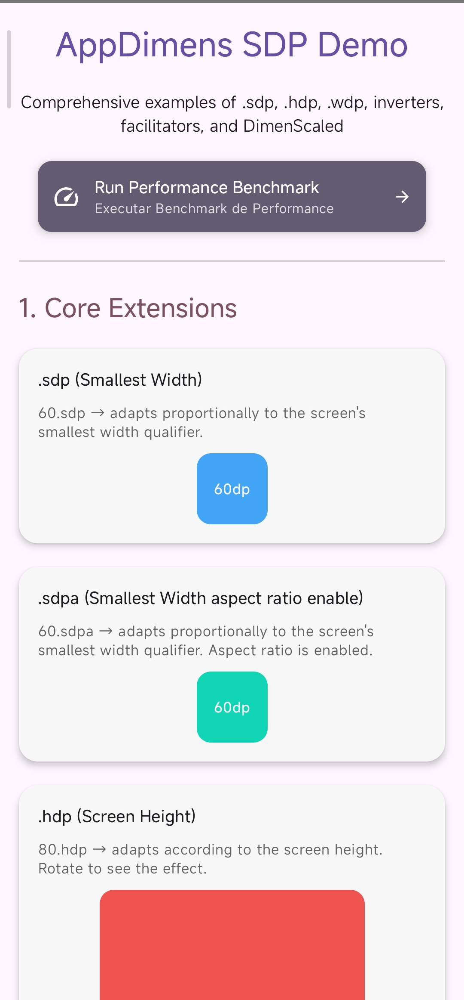
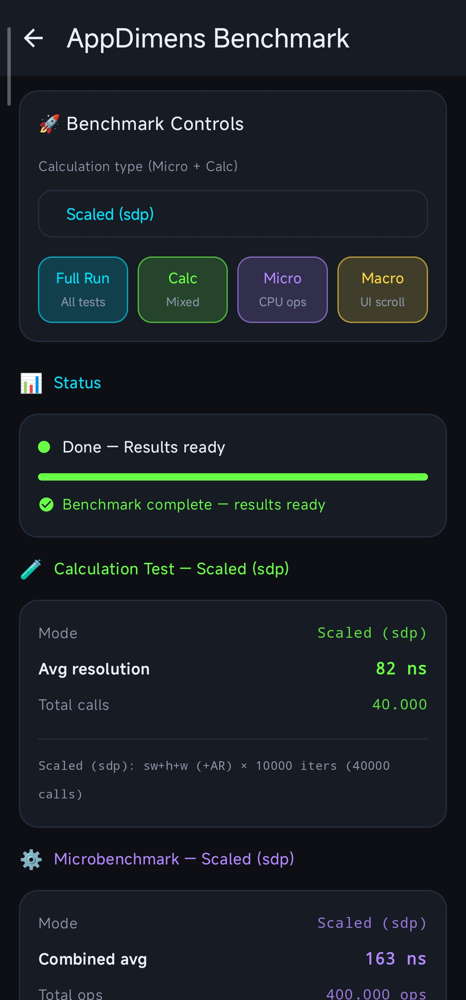

# AppDimens Dynamic

## Responsive `dp` / `sp` for Android — Jetpack Compose and Kotlin APIs

<p align="center">
  
  <a href="https://github.com/bodenberg/appdimens-dynamic/releases" title="Releases">
    
  </a>
  &nbsp;
  <a href="LICENSE" title="Apache License 2.0">
    
  </a>
  &nbsp;
  <a href="https://developer.android.com" title="Android platform">
    
  </a>
  &nbsp;
  
  &nbsp;
  
  &nbsp;
  
  &nbsp;
  <a href="./DOCUMENTATION/README.md" title="Scaling strategies and modules">
    
  </a>
</p>

<p align="center">
  <a href="./GUIDE-FOR-BEGINNERS.md" title="Step-by-step guide for beginners">
    
  </a>
  &nbsp;&nbsp;
  <a href="./DOCUMENTATION/README.md" title="Strategies, formulas, and when to use each scaling mode">
    
  </a>
  &nbsp;&nbsp;
  <a href="./DOCUMENTATION/index.md" title="API documentation — Markdown package index (KDoc export)">
    
  </a>
  &nbsp;&nbsp;
  <a href="https://appdimens3.web.app/" title="Hosted Dokka — searchable API reference">
    
  </a>
</p>

<p align="center">
  <a href="./PERFORMANCE.md" title="Technical performance report">
    
  </a>
  &nbsp;&nbsp;
  <a href="./PERFORMANCE-COMPARATIVE.md" title="Performance after optimization phases — comparative report">
    
  </a>
  &nbsp;&nbsp;
  <a href="./R8-PROGUARD.md" title="R8 full mode and ProGuard rules — library, consumer, app">
    
  </a>
</p>

---


Write values like `16.sdp` and the library scales them from the current screen **Configuration** (size, density, optional flags).

**New here?** Use **Quick start** below, then [**GUIDE-FOR-BEGINNERS**](./GUIDE-FOR-BEGINNERS) for every strategy in plain language.

**Documentation:** [DOCUMENTATION/README.md](DOCUMENTATION/README.md) · [DOCUMENTATION/MODULES.md](DOCUMENTATION/MODULES.md) · [KDoc (hosted)](https://appdimens3.web.app/) · [PRD](DOCUMENTATION/PRD.md) · [PDR](DOCUMENTATION/PDR.md) · [Mathematics](DOCUMENTATION/MATHEMATICS-AND-CALCULUS.md)

---

## Installation (v3.2.0)

**3.2.0** keeps the modular packaging introduced in **3.1.6**: the library ships as a **principal** artifact (`common` + `core` + **scaled** + `plain`) plus optional strategy modules. Kotlin packages and imports are unchanged.

### With BOM

```kotlin
dependencies {
    implementation(platform("io.github.bodenberg:appdimens-dynamic-bom:3.2.0"))

    implementation("io.github.bodenberg:appdimens-dynamic")

    implementation("io.github.bodenberg:appdimens-dynamic-percent")
    implementation("io.github.bodenberg:appdimens-dynamic-power")
    implementation("io.github.bodenberg:appdimens-dynamic-fluid")
    implementation("io.github.bodenberg:appdimens-dynamic-auto")
    implementation("io.github.bodenberg:appdimens-dynamic-density")
    implementation("io.github.bodenberg:appdimens-dynamic-diagonal")
    implementation("io.github.bodenberg:appdimens-dynamic-fill")
    implementation("io.github.bodenberg:appdimens-dynamic-fit")
    implementation("io.github.bodenberg:appdimens-dynamic-interpolated")
    implementation("io.github.bodenberg:appdimens-dynamic-logarithmic")
    implementation("io.github.bodenberg:appdimens-dynamic-perimeter")
    implementation("io.github.bodenberg:appdimens-dynamic-resize")
    implementation("io.github.bodenberg:appdimens-dynamic-units")
}
```

### Missing strategy module

If you import `com.appdimens.dynamic.compose.<strategy>` (or `code.<strategy>`) without adding the matching artifact, the Gradle check `checkAppDimensModules` fails with a line such as:

```text
Missing AppDimens module for import …percent… — add: implementation("io.github.bodenberg:appdimens-dynamic-percent:3.2.0")
```

Apply the same check in your app with:

```kotlin
apply(from = "<path-to-checkout>/gradle/appdimens-missing-module-check.gradle.kts")
```

Runtime helper: `com.appdimens.dynamic.core.MissingModule` (package → Maven coordinate). Version comes from the `appdimens.version` Gradle property.

### Without BOM

```kotlin
dependencies {
    implementation("io.github.bodenberg:appdimens-dynamic:3.2.0")
    implementation("io.github.bodenberg:appdimens-dynamic-percent:3.2.0")
    // same satellites as above, each with :3.2.0
}
```

### Artifact matrix

| Maven artifact | Contents |
|----------------|----------|
| `appdimens-dynamic` | `common`, `core`, `code.plain`, `code` / `compose` **scaled** |
| `appdimens-dynamic-<strategy>` | `code.<strategy>` + `compose.<strategy>` |
| `appdimens-dynamic-bom` | Version constraints (`java-platform`) |

Module graph: [DOCUMENTATION/MODULES.md](DOCUMENTATION/MODULES.md).

**Requirements:** Min SDK **24** · Compile SDK **36** · **Kotlin** & **Java 17** · **Jetpack Compose** (consumer-provided — the library declares Compose as `compileOnly` and never pins a version, so any Compose version works without conflict)

---

## Quick start — Scaled (Compose)

```kotlin
import com.appdimens.dynamic.compose.*

Box(
    Modifier
        .padding(16.sdp)
        .width(100.wdp)
        .height(48.hdp)
) {
    Text("Hello", fontSize = 16.ssp)
}
```

| Extension | Based on | Typical use |
|-----------|----------|-------------|
| **`sdp`** | Smallest window width | Padding, margins |
| **`hdp`** | Screen height | Row height |
| **`wdp`** | Screen width | Column width |
| **`ssp`** | Same idea as `sdp`, for text | `fontSize` |
| **`sem`** | Same idea as `sdp`, for text | `fontSize ignore system font scale` |

---

## Compose — setup before advanced APIs

**If you only use `sdp` / `hdp` / `wdp` / `ssp` / `hsp` / `wsp`/ `sem` / `hem` / `wem` (and variants like `sdpa`), you can skip this block.**

### `AppDimensProvider`

Use it when you call **`.sdpMode`**, **`.sdpScreen`**, **`.sspMode`**, **`.sspScreen`**, or similar **facilitators** that depend on **UI mode / fold state**. It sets `LocalUiModeType` once for the tree instead of resolving mode on every call, and (since 3.1.8) provides `LocalDimenMetrics` — a coherent per-window snapshot that every `rememberDimen*` helper uses.

```kotlin
import com.appdimens.dynamic.core.AppDimensProvider

setContent {
    AppDimensProvider {
        MyApp()
    }
}
```

### `DimenCache.invalidateOnConfigChange`

Since **3.1.8** the cache is **partitioned per window snapshot** (`DimenMetrics`): every resolution is keyed by the exact configuration it was computed for, so a rotated, resized, or recreated window can never read a stale value. Explicit invalidation is therefore **not required for correctness** — this API is retained as a compatibility hook and no longer wipes other windows’ hot entries.

Call it when the **same Activity** stays alive across **rotation, split-screen, or density/font changes** and you want to refresh internal bookkeeping. If the Activity is **recreated** on config change (default), you don’t need it. Details: [library/PERFORMANCE.md](library/PERFORMANCE.md).

The previous `Configuration` is tracked internally by `DimenCache` — callers only need to pass the new one.

```kotlin
import com.appdimens.dynamic.core.DimenCache

override fun onConfigurationChanged(newConfig: Configuration) {
    super.onConfigurationChanged(newConfig)
    DimenCache.invalidateOnConfigChange(newConfig)
}
```

You only get `onConfigurationChanged` if the Activity lists `android:configChanges` for those changes in the manifest; otherwise the process usually recreates the Activity and config is fresh automatically.

---

## Compose — next steps

### Suffixes (`a`, `i`, `ia`)

| Suffix | Meaning |
|--------|---------|
| *(none)* | Default |
| **`a`** | Aspect ratio–aware curve |
| **`i`** | Ignore multi-window heuristic (may return unscaled base when it triggers) |
| **`ia`** | Both |

```kotlin
16.sdpa      // + aspect ratio
32.hdpi      // height axis + ignore multi-window
16.sspa      // scalable sp + aspect ratio
```

### More text styles

```kotlin
Text("Scaled (sw)", fontSize = 16.ssp)
Text("Scaled (height)", fontSize = 20.hsp)
Text("Scaled (width)", fontSize = 18.wsp)
Text("No system font scale (sw)", fontSize = 16.sem)   // sem / hem / wem
```

### Orientation inverters (examples)

```kotlin
32.sdpPh   // SW-based; in portrait uses height
32.sdpLw   // SW-based; in landscape uses width
50.hdpLw   // Height-based; in landscape uses width
50.wdpLh   // Width-based; in landscape uses height
```

### Facilitators (after `AppDimensProvider` if you use mode/screen)

```kotlin
import com.appdimens.dynamic.compose.*
import com.appdimens.dynamic.common.DpQualifier
import com.appdimens.dynamic.common.Orientation
import com.appdimens.dynamic.common.UiModeType

80.sdpRotate(50, orientation = Orientation.LANDSCAPE)
30.sdpMode(200, UiModeType.TELEVISION)
60.sdpQualifier(120, DpQualifier.SMALL_WIDTH, 600)
16.sspRotate(24, orientation = Orientation.LANDSCAPE)
```

Full catalog: [DOCUMENTATION/COMPOSE-API-CONVENTIONS.md](DOCUMENTATION/COMPOSE-API-CONVENTIONS.md).

### Builders (`scaledDp` / `scaledSp`)

```kotlin
val pad = 16.scaledDp()
    .aspectRatio(true)
    .screen(UiModeType.TELEVISION, 40)
    .screen(DpQualifier.SMALL_WIDTH, 600, 24)
    .sdp
```

### Auto-resize (inside `BoxWithConstraints`)

Picks the **largest** font or size in a **min…max** range that still **fits** the space. Use for titles, squares, etc.

```kotlin
import androidx.compose.foundation.layout.BoxWithConstraints
import androidx.compose.foundation.layout.fillMaxWidth
import androidx.compose.ui.Modifier
import com.appdimens.dynamic.compose.resize.autoResizeTextSp

BoxWithConstraints(Modifier.fillMaxWidth()) {
    val fontSize = autoResizeTextSp(
        text = "Headline that must fit",
        minSp = 12,
        maxSp = 28,
        stepSp = 1,
        maxLines = 2,
    )
    Text("Headline that must fit", fontSize = fontSize, maxLines = 2)
}
```

More APIs (`autoResizeSquareSize`, `ResizeBound`, …): [DOCUMENTATION/resize.md](DOCUMENTATION/resize.md).

---

## Kotlin (Views / non-Composable)

```kotlin
import com.appdimens.dynamic.code.DimenSdp
import com.appdimens.dynamic.code.DimenSsp

val paddingPx = DimenSdp.sdp(context, 16)
val heightPx = DimenSdp.hdp(context, 32)
val widthPx = DimenSdp.wdp(context, 100)
val fontPx = DimenSsp.ssp(context, 16)

// Extensions (see code package)
// 16.ssp(context), DimenSdp.scaled(16).screen(...).sdp(context), sdpRotate, …
```

---

## Java

```java
import com.appdimens.dynamic.code.DimenSdp;
import com.appdimens.dynamic.code.DimenScaled;
import com.appdimens.dynamic.code.DimenSsp;
import com.appdimens.dynamic.common.UiModeType;

float paddingPx = DimenSdp.sdp(context, 16);
float heightPx = DimenSdp.hdp(context, 32);
float fontPx = DimenSsp.ssp(context, 16);

DimenScaled scaled = DimenSdp.scaled(16)
    .applyAspectRatio(true)
    .screen(UiModeType.TELEVISION, 32);
float result = scaled.sdp(context);
```

---

## Physical units (mm, cm, inch)

Approximate **real-world** size on screen (density-based). Compose: use helpers from the library and **`.dp`** on the result where needed — see [DOCUMENTATION/physical-units.md](DOCUMENTATION/physical-units.md). Code module: `com.appdimens.dynamic.code.units.DimenPhysicalUnits` (`toDpFromMm`, …).

---

<p align="center">
  
  &nbsp;
  
</p>

---

## More strategies & full API

**Recommendation order for most apps:** **Scaled** (with or without `a`) → then **percent** → then **auto**; explore the rest when you have a clear need (fluid, fit, diagonal, etc.).

Other strategies (**percent**, **power**, **fluid**, **auto**, **diagonal**, **fill**, **fit**, **interpolated**, **logarithmic**, **perimeter**, **density**, **resize**, **units**) mirror the Scaled suffix patterns under a different import prefix and ship as separate Maven modules. See [DOCUMENTATION/MODULES.md](DOCUMENTATION/MODULES.md), [DOCUMENTATION/README.md](DOCUMENTATION/README.md), and [GUIDE-FOR-BEGINNERS](./GUIDE-FOR-BEGINNERS).

| Resource | Use for |
|----------|---------|
| [DOCUMENTATION/README.md](DOCUMENTATION/README.md) | Per-strategy explanations |
| [DOCUMENTATION/MODULES.md](DOCUMENTATION/MODULES.md) | Gradle/Maven module graph (3.2.0) |
| [COMPOSE-API-CONVENTIONS.md](DOCUMENTATION/COMPOSE-API-CONVENTIONS.md) | Every Compose property & facilitator (scaled catalog + prefix map) |
| [DOCUMENTATION/index.md](DOCUMENTATION/index.md) | Markdown API index (KDoc export) |
| [appdimens3.web.app](https://appdimens3.web.app/) | Searchable KDoc |

**Example app:** `app/.../compose/ExampleActivity.kt` (includes auto-resize demos).

---

## Optional: cache & performance

- Results are cached in **`DimenCache`** — lock-free, **partitioned per window/configuration snapshot** (no disk persistence since 3.1.8).
- Some paths **skip** storing in the snapshot cache when a cheap multiply is enough — see [library/PERFORMANCE.md](library/PERFORMANCE.md).
- **Batch / low-level keys:** not needed for normal app code; library extensions already use the cache.

---

**Scaled** uses **300 dp** as the design reference. It is the **most widely used** strategy in real apps and the **recommended default**: use plain `sdp` / `hdp` / `wdp` / `ssp` when a single curve is enough, and the **`a`** suffix (aspect ratio–aware), e.g. `16.sdpa`, when you want scaling tuned to screen shape. **After Scaled**, the next strategies teams typically adopt are **percent** (sizes as a fraction of an axis) and **auto** (breakpoint-style steps); the other modes are for specialized layouts — see [DOCUMENTATION/README.md](DOCUMENTATION/README.md).

---

**Facilitators — two “Plain” styles:** `*RotatePlain`, `*ModePlain`, `*QualifierPlain`, `*ScreenPlain` (and `*PlainPx`) exist with the alternate as **`Number`** (active branch still runs through scaling/cache) or as **`Dp` / `TextUnit`** (only the condition is evaluated; **no** second scaling). For **nested** chains such as `30.sdp.sdpRotatePlain(20.sdp).sdpModePlain(40.sdp, UiModeType.TELEVISION)`, prefer **`Dp` / `TextUnit` alternates** so neither the receiver nor the alternate is scaled twice. **Nesting order** is the order you write the chain (outer → inner). That is **different** from **`DimenScaled` `.screen` chains**, where **priority is defined inside the builder API**, not by lexical nesting — see [DOCUMENTATION/COMPOSE-API-CONVENTIONS.md](DOCUMENTATION/COMPOSE-API-CONVENTIONS.md).

---

**Views / `code`:** the same **logic-only** Plain branching exists on **`Float` px** + **`Context`** — `Dimen*PlainPx.kt` per strategy (e.g. `psdpRotatePlainPx` in `com.appdimens.dynamic.code.percent`), with shared helpers in **`com.appdimens.dynamic.code.plain`** (`DimenPlainBranch.kt`). **Dp/Sp facilitator** sources use the same **`Dimen<Strategy>DpExtensions.kt` / `Dimen<Strategy>SpExtensions.kt`** names as in `compose/<strategy>/` (scaled: `DimenSdpExtensions.kt` / `DimenSspExtensions.kt` under `code/scaled/`). Details in [DOCUMENTATION/COMPOSE-API-CONVENTIONS.md](DOCUMENTATION/COMPOSE-API-CONVENTIONS.md) §4.5 and [DOCUMENTATION/README.md](DOCUMENTATION/README.md).

---

## Highlights (v3.x)

- Code-only scaling (no XML dimen grids) · **SDP / HDP / WDP** + **14** scaling modes  
- **Aspect ratio** & **multi-window** flags · **Inverters** & **facilitators** · **Foldable** awareness via WindowManager  
- **Physical units** · **Resize** helpers · **DimenScaled** chains  

### What's New in 3.2.0

| Change | Description |
|--------|-------------|
| **Compose-BOM independence** | The library no longer version-pins `androidx.compose:compose-bom`. The BOM is `implementation`-scoped in the library, but the consumer's `compose-bom` (when declared, regardless of version) takes over via Gradle's constraint resolution. The library only ever references Compose's stable public API (`Density`, `Dp`, `CompositionLocal`, `@Composable`, `Modifier`), so any modern Compose version works. |
| **R8 "Missing class" notes silenced** | Every AAR's `consumer-rules.pro` (principal + 13 satellites) now adds `-dontnote` / `-dontwarn` for `androidx.compose.{runtime,ui,foundation,animation}.**`. This silences the noisy "Missing class" output that R8 emits when the consumer's Compose version differs from the BOM the AAR was compiled against — those notes are never real problems, just artifact-of-different-versions noise. |
| **Compose-bom version check** | `appdimens-missing-module-check.gradle.kts` now reports the detected `compose-bom` version(s) at build time as a `lifecycle` log line, so consumers can quickly confirm which BOM they resolved against. |

### What's New in 3.1.9

| Change | Description |
|--------|-------------|
| **Atomic fast-partition slot** | The `metrics + partition` pair of the single-window fast lane is now published as **one** `@Volatile` `FastPartitionSlot` instead of two independent `@Volatile` fields. This eliminates a race where a multi-window app could transiently resolve against another window's partition (`partition(B) + metrics(A)`), returning a dimension computed for a different snapshot. |
| **Hardened race tests** | `DimenCacheRaceTest` now fails on **any** wrong return value (no transient `peek()` escape hatch), requires each thread to get **its own** value back (not merely one of the valid set), and adds `concurrentSnapshots_neverReturnValueFromAnotherSnapshot` — 8 threads × 20k iterations alternating between two `DimenMetrics` snapshots, asserting zero cross-snapshot contamination. |
| **Diagnostics counters internal** | `hitCount` / `missCount` / `evictionCount` are now `@PublishedApi internal` instead of `@JvmField` public — no longer part of the public API surface. |

### What's New in 3.1.8

| Change | Description |
|--------|-------------|
| **Event-driven config watcher** | Replaces the sampled per-window validation (`validationTick`). A `ComponentCallbacks2` listener registered on the Application invalidates fast slots synchronously on any real configuration change — zero sampling cost on the hot lane. |
| **Specialized kernels** | `resolveSdpPx`, `resolveSdpDp`, `resolveSdpaPx`, `resolveSdpaDp`, `resolveHdpPx`, `resolveHdpDp`, `resolveWdpPx`, `resolveWdpDp` — one kernel per family/qualifier, zero branches, volatile load + identity compare + legacy multiply order. |
| **`fastMetricsForCode`** | Non-Compose fast-lane resolution: skips the ThreadLocal probe entirely — one volatile load, one identity compare, two float multiplies on the hit path. |
| **`metricsCoherentFor` simplified** | No more validation tick sampling; just identity check against the fast slot. |
| **DimenMetrics eager computation** | `normalizedAspectRatio` and `logNormalizedAspectRatio` changed from `lazy` to plain `val` — removes the hidden `synchronized` probe from the SDPA fast lane. |
| **DimenSdpExtensions specialized routing** | `fastScaledPx` replaced by `sdpPx`, `sdpaPx`, `hdpPx`, `wdpPx` — each routes straight to its branch-free specialized kernel. |
| **`invalidateOnConfigChange` enhanced** | Now also nulls `fastWindowSlot` and `fastMwContext` — event-driven coherence. |
| **Comparison benchmark** | On-device 3.1.8 vs 3.1.6 speed + precision comparison with 2 test runs. |
| **BenchLab module** | New competitor benchmark: Dynamic vs SDPS vs Lib #2 — full scroll screenshot + report export. |

---

*Apache License 2.0 — responsive layout utilities for Android.*
